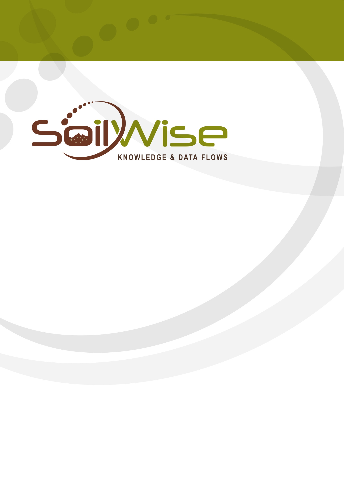

This project has received funding from the Horizon Europe research and innovation programme under Grant Agreement No 101112838.

M34/June 2026

# D4.6 User Manual V1

| Acronym                     | SoilWise                                                                                                                                                                                                                                                                                                                                                                                                                                                                                  |
| --------------------------- | ----------------------------------------------------------------------------------------------------------------------------------------------------------------------------------------------------------------------------------------------------------------------------------------------------------------------------------------------------------------------------------------------------------------------------------------------------------------------------------------- |
| Project Full Title          | **An open access knowledge and data metadata catalogue to safeguard soils**                                                                                                                                                                                                                                                                                                                                                                                                               |
| GA number                   | **101112838**                                                                                                                                                                                                                                                                                                                                                                                                                                                                             |
| Topic                       | **HORIZON-MISS-2022-SOIL-01-01**                                                                                                                                                                                                                                                                                                                                                                                                                                                          |
| Type of Action              | **HORIZON Innovation Actions**                                                                                                                                                                                                                                                                                                                                                                                                                                                            |
| Project Duration            | **48 months**                                                                                                                                                                                                                                                                                                                                                                                                                                                                             |
| Project Start Date          | **1-Sep-23**                                                                                                                                                                                                                                                                                                                                                                                                                                                                              |
| Project Website             | **<www.SoilWise-he.eu>**                                                                                                                                                                                                                                                                                                                                                                                                                                                                  |
| Deliverable Title           | **User Manual V1**                                                                                                                                                                                                                                                                                                                                                                                                                                                                        |
| Delivery Time (DOA)         | **M34**                                                                                                                                                                                                                                                                                                                                                                                                                                                                                   |
| Deliverable Submission Date | **30.06.2026**                                                                                                                                                                                                                                                                                                                                                                                                                                                                            |
| Status                      | **Final**                                                                                                                                                                                                                                                                                                                                                                                                                                                                                 |
| Dissemination Level         | **PU - Public**                                                                                                                                                                                                                                                                                                                                                                                                                                                                           |
| Deliverable Lead            | **EV ILVO**                                                                                                                                                                                                                                                                                                                                                                                                                                                                               |
| Author(s)/Organisation(s)   | **Radu Giurgiu (EV ILVO); Paul van Genuchten (ISRIC), Rob Lokers (WR), Dajana Snopková (MU),**  **Fenny van Egmond (ISRIC), Tomáš Pavelka (MU), Tomáš Řezník (MU), Max Vercruyssen (DOMG),**  **Ronald Kilian (WE), Celine Blitz-Freyer (CIRAD), Rob Knapen (WR), Beichen Wang (WU); Jiarong Li (ISRIC),**                                                                                                                                                                    |
| Contributor(s)              | **EV ILVO, MU, ISIRC, WR, WU, WE, CIRAD, BIOS,**                                                                                                                                                                                                                                                                                                                                                                                                                                          |
| Peer-Reviewers              | **ISRIC, WR**                                                                                                                                                                                                                                                                                                                                                                                                                                                                             |
| Contact                     | **<radu.giurgiu@ilvo.vlaanderen.be>**                                                                                                                                                                                                                                                                                                                                                                                                                                                     |
| Work Package                | **4**                                                                                                                                                                                                                                                                                                                                                                                                                                                                                     |
| Keywords                    | **soil, soil health, FAIR, metadata catalogue, Mission Soil, EUSO, European Soil Observatory,**  **knowledge catalogue, user manual**                                                                                                                                                                                                                                                                                                                                               |
| Abstract                    | **This deliverable presents the first version of the SoilWise User Manual: a plain-language reference describing**  **the SoilWise Catalogue, its thirteen components, and how to use it. The manual is written for the least technical**  **reader and primarily addresses staff of the European Soil Observatory (EUSO) at the Joint Research Centre (JRC),**  **as well as Mission Soil project participants, Living Labs, policy makers, and consortium partners.** |

Disclaimer

The content of this deliverable represents the views of the author(s) only and does not necessarily reflect the official opinion of the European Union. The European Union institutions and bodies or any person acting on their behalf are not responsible for any use that may be made of the information it contains.

In this document, the acronym 'DOMG – VL O' is used to refer to the Department of the Environment and Spatial Development, Flanders, Belgium, as per the partner's request for clarification. It's noted that in the grant agreement, the partner is identified by the acronym VL O (Vlaamse Gewest).

List of Abbreviations

| AI            | Artificial Intelligence                                                                                                                     |
| ------------- | ------------------------------------------------------------------------------------------------------------------------------------------- |
| **API**       | Application Programming Interface                                                                                                           |
| **AGROVOC**   | Multilingual agricultural and food science thesaurus maintained by FAO                                                                      |
| **CORDIS**    | Community Research and Development Information Service                                                                                      |
| **CSW**       | Catalogue Service for the Web                                                                                                               |
| **DCAT**      | Data Catalog Vocabulary (W3C standard for describing datasets and catalogues)                                                               |
| **DOI**       | Digital Object Identifier                                                                                                                   |
| **ECAS**      | European Commission Authentication Service — see EU Login                                                                                   |
| **EEA**       | European Environment Agency                                                                                                                 |
| **ESDAC**     | European Soil Data Centre (hosted by JRC)                                                                                                   |
| **ETL**       | Extract, Transform, Load — a data integration approach                                                                                      |
| **EUSO**      | European Soil Observatory (hosted by JRC)                                                                                                   |
| **FAIR**      | Principles on Findability, Accessibility, Interoperability, Reusability                                                                     |
| **FAO**       | Food and Agriculture Organisation of the United Nations                                                                                     |
| **GEMET**     | General Multilingual Environmental Thesaurus (maintained by EEA)                                                                            |
| **GPkg**      | Geopackage (OGC standard), file based relational database with spatial support (SQLite)                                                     |
| **GML**       | Geography Markup Language (OGC/ISO standard for geographic features)                                                                        |
| **HVD**       | High Value-Data (EU Regulation)                                                                                                             |
| **INSPIRE**   | INfrastructure for SPatial InfoRmation in Europe (EU regulation)                                                                            |
| **JRC**       | Joint Research Centre of the European Commission                                                                                            |
| **LLM**       | Large Language Model — an AI system trained on large text corpora to understand and generate natural language                               |
| **MCP**       | Model Context Protocol — an open standard for connecting AI assistants to external tools and data sources                                   |
| **NER**       | Named Entity Recognition — a natural language processing technique for identifying proper nouns in text                                     |
| **OAI-PMH**   | Open Archives Initiative Protocol for Metadata Harvesting                                                                                   |
| **OGC**       | Open Geospatial Consortium — standards body for spatial data and services                                                                   |
| **OIDC**      | OpenID Connect — an authentication layer built on OAuth 2.0                                                                                 |
| **OMS (O&M)** | Observations, Measurements & Samples (OGC standard, ISO 19156;2023)                                                                         |
| **ORCID**     | Open Researcher and Contributor ID — a persistent digital identifier for researchers                                                        |
| **PID**       | Persistent IDentifier                                                                                                                       |
| **QGIS**      | Open-source Geographic Information System software                                                                                          |
| **RAG**       | Retrieval-Augmented Generation — an AI technique that grounds language model answers in retrieved documents                                 |
| **RDF**       | Resource Description Framework — a W3C standard for representing structured information on the web as subject–predicate–object triples      |
| **ROR**       | Research Organization Registry — a persistent identifier for research organisations                                                         |
| **SHKG**      | Soil Health Knowledge Graph (see Glossary)                                                                                                  |
| **SKOS**      | Simple Knowledge Organization System — a W3C standard for representing controlled vocabularies, thesauri, and classification schemes in RDF |
| **SML**       | Soil Monitoring Law (EU Regulation)                                                                                                         |
| **SOC**       | Soil Organic Carbon                                                                                                                         |
| **SPARQL**    | SPARQL Protocol and RDF Query Language — the standard query language for RDF triple stores                                                  |
| **STAC**      | SpatioTemporal Asset Catalog — an open standard for describing geospatial data                                                              |
| **SWC**       | SoilWise Catalogue                                                                                                                          |
| **URI**       | Uniform Resource Identifier — a string that uniquely identifies a resource on the internet                                                  |
| **W3C**       | World Wide Web Consortium — the main international standards body for the web                                                               |
| **WCS**       | Web Coverage Service (OGC standard for raster/gridded data)                                                                                 |
| **WFS**       | Web Feature Service (OGC standard for vector geographic data)                                                                               |
| **WMS**       | Web Map Service (OGC standard for map images)                                                                                               |
| **WMTS**      | Web Map Tile Service (OGC standard for pre-rendered map tiles)                                                                              |
| **WP**        | Work Package (a subdivision of a Horizon Europe project)                                                                                    |

Glossary

| AGROVOC                                  | The Food and Agriculture Organisation's multilingual agricultural thesaurus, covering agriculture, forestry, fisheries, food, and related domains. Used by SoilVoc and the Metadata Augmentation component for keyword matching.                                                                                                                                                                                                                       |
| ---------------------------------------- | ------------------------------------------------------------------------------------------------------------------------------------------------------------------------------------------------------------------------------------------------------------------------------------------------------------------------------------------------------------------------------------------------------------------------------------------------------ |
| **Apache Solr**                          | Open-source search platform (built on Apache Lucene) used by SoilWise to index metadata and documents and to support fast full-text, faceted, and (planned) semantic search.                                                                                                                                                                                                                                                                           |
| **Authentication**                       | The process of verifying that a user is who they claim to be (e.g., by checking a password or identity token). Handled in SoilWise by Keycloak and, in future, EU Login.                                                                                                                                                                                                                                                                               |
| **Authorisation**                        | The process of deciding what an authenticated user is allowed to do (e.g., read records, trigger a harvester, or administer the catalogue). Distinct from authentication.                                                                                                                                                                                                                                                                              |
| **Chatbot / conversational assistant**   | A soil-domain conversational assistant powered by large language models, featuring autonomous tool-calling across multiple knowledge sources and a dynamic Insight panel for vocabulary-linked exploration.                                                                                                                                                                                                                                            |
| **Container / containerisation**         | A lightweight way to package software so that it runs consistently across different computing environments. SoilWise components are all containerised using Docker and orchestrated with Kubernetes.                                                                                                                                                                                                                                                   |
| **Controlled vocabulary**                | A predefined, managed list of terms used to describe resources consistently. Examples used in SoilWise: SoilVoc, AGROVOC, GEMET, GLOSIS.                                                                                                                                                                                                                                                                                                               |
| **DataCite**                             | A metadata schema and DOI registration agency for research datasets and other scholarly outputs. Zenodo uses DataCite metadata.                                                                                                                                                                                                                                                                                                                        |
| **DCAT**                                 | Data Catalog Vocabulary — a W3C standard for describing datasets and data catalogues in RDF, used by data.europa.eu and other open data portals.                                                                                                                                                                                                                                                                                                       |
| **End-to-end**                           | Covering the entire workflow from start to finish — in SoilWise, from the moment metadata is harvested from a remote repository through to its display in the Finder or use by the Soil Companion.                                                                                                                                                                                                                                                     |
| **EU Login (ECAS)**                      | The European Commission's central authentication service, allowing public sector users to access EU platforms with a single set of credentials. Planned integration into SoilWise for the Soil Companion.                                                                                                                                                                                                                                              |
| **Faceted search**                       | A search approach that lets users narrow results by applying multiple filters simultaneously (e.g., resource type AND geographic scope AND licence). Used by the SoilWise Finder.                                                                                                                                                                                                                                                                      |
| **GEMET**                                | General Multilingual Environmental Thesaurus — a multilingual environmental vocabulary maintained by the European Environment Agency (EEA). Referenced in SoilVoc and the SHKG.                                                                                                                                                                                                                                                                        |
| **GLOSIS**                               | Global Soil Information System — a FAO framework and vocabulary for soil data interoperability, referenced in SoilVoc.                                                                                                                                                                                                                                                                                                                                 |
| **Grafana**                              | Open-source monitoring and data visualisation tool used by SoilWise to display system health dashboards (available at grafana.SoilWise.wetransform.eu for the operations team).                                                                                                                                                                                                                                                                        |
| **Hale Studio**                          | An open-source extract-transform-load (ETL) tool for complex spatial data transformations, used by the SoilWise community for converting between data formats and mapping to INSPIRE models.                                                                                                                                                                                                                                                           |
| **Harvesting**                           | The automated process by which SoilWise periodically collects (harvests) metadata records from external repositories and aggregators. The Harvester component performs this step.                                                                                                                                                                                                                                                                      |
| **ISO 11074**                            | International standard defining soil quality terms and their definitions. Referenced in SoilVoc and the SHKG.                                                                                                                                                                                                                                                                                                                                          |
| **ISO 19115**                            | International standard for geographic information metadata. Used by INSPIRE-compliant spatial data catalogues.                                                                                                                                                                                                                                                                                                                                         |
| **Keycloak**                             | Open-source identity and access management software used by SoilWise as the central OpenID Connect (OIDC) identity provider (available at id.SoilWise.wetransform.eu).                                                                                                                                                                                                                                                                                 |
| **Kubernetes**                           | Open-source system for automating the deployment and management of containerised applications. SoilWise components are deployed on Kubernetes clusters (currently WeTransform's, planned migration to JRC).                                                                                                                                                                                                                                            |
| **Large Language Model (LLM)**           | An AI system trained on large text corpora that can understand and generate human language. The Soil Companion uses an LLM (currently OpenAI) together with retrieval and domain knowledge to answer soil questions.                                                                                                                                                                                                                                   |
| **Linked Data**                          | A set of W3C principles and technologies (RDF, SPARQL, URIs) for publishing structured data on the web in a way that allows datasets to be interlinked and queried across sources.                                                                                                                                                                                                                                                                     |
| **Loki**                                 | Open-source log aggregation system used alongside Grafana and Promtail to collect and store log records from SoilWise services.                                                                                                                                                                                                                                                                                                                        |
| **Metadata**                             | Structured information that describes a resource: its title, authors, date, licence, geographic coverage, keywords, and so on. SoilWise works with metadata, not with the underlying data files themselves.                                                                                                                                                                                                                                            |
| **Metadata knowledge graph**             | The RDF representation of SoilWise's harvested metadata records, stored in Virtuoso. Allows semantic queries via SPARQL. Distinct from the Soil Health Knowledge Graph (SHKG).                                                                                                                                                                                                                                                                         |
| **Model Context Protocol (MCP)**         | An open standard that allows AI assistants to connect to external tools, databases, and services. The Soil Companion uses MCP to access geospatial data services.                                                                                                                                                                                                                                                                                      |
| **OAI-PMH**                              | Open Archives Initiative Protocol for Metadata Harvesting — a lightweight protocol for harvesting metadata records from digital repositories.                                                                                                                                                                                                                                                                                                          |
| **OpenAIRE**                             | A European open science infrastructure that aggregates research outputs from EU-funded projects. SoilWise harvests metadata from OpenAIRE to discover Mission Soil project outputs.                                                                                                                                                                                                                                                                    |
| **ORCID**                                | Open Researcher and Contributor ID — a persistent digital identifier for researchers, used by the RORcider augmentation tool to identify authors in metadata records.                                                                                                                                                                                                                                                                                  |
| **Pipeline**                             | A workflow or process running some tasks, usually triggered by an event or configured to run at intervals                                                                                                                                                                                                                                                                                                                                              |
| **PostgreSQL**                           | Open-source relational database management system used by SoilWise as the primary structured data store for raw and augmented metadata records.                                                                                                                                                                                                                                                                                                        |
| **Prometheus**                           | Open-source monitoring and alerting toolkit used by SoilWise to collect health and performance metrics from all system components.                                                                                                                                                                                                                                                                                                                     |
| **Retrieval-Augmented Generation (RAG)** | An AI technique that combines a language model with a retrieval step: the model first retrieves relevant documents from a knowledge base, then uses them to generate a grounded answer. Used by the Soil Companion.                                                                                                                                                                                                                                    |
| **ROR**                                  | Research Organization Registry — a global, community-led registry of open persistent identifiers for research organisations. Used by the RORcider augmentation tool.                                                                                                                                                                                                                                                                                   |
| **Semantic index**                       | A semantic index organizes content based on its underlying meaning and context rather than literal keyword matches. It uses natural language processing to understand the intent behind queries, allowing search systems to connect ideas even if the exact words are different                                                                                                                                                                        |
| **SKOS**                                 | Simple Knowledge Organization System — a W3C standard for representing controlled vocabularies, thesauri, and classification schemes in RDF. SoilVoc is published in SKOS.                                                                                                                                                                                                                                                                             |
| **Skosmos**                              | A web-based tool for publishing and browsing SKOS vocabularies. SoilVoc's frontend is migrating to Skosmos.                                                                                                                                                                                                                                                                                                                                            |
| **Soil Health Knowledge Graph (SHKG)**   | An RDF knowledge graph of soil-health concepts derived semi-automatically from a curated set of soil-health literature and validated by domain experts. Contains 11,719 triples across 2,017 entities; linked to AGROVOC, ISO 11074:2025, GloSIS, INRAE, and GEMET; accessible via SPARQL at sparql.SoilWise.wetransform.eu/sparql; published on Zenodo (DOI: 10.5281/zenodo.15596414). Distinct from the metadata knowledge graph stored in Virtuoso. |
| **SoilGrids**                            | A global gridded soil information system produced by ISRIC, providing modelled estimates of soil properties (such as soil organic carbon, pH, texture) at approximately 250-metre resolution. Optionally consulted by the Soil Companion.                                                                                                                                                                                                              |
| **SoilVoc**                              | A SKOS-based soil science thesaurus linking soil properties to measurement procedures, integrating concepts from AGROVOC, GEMET, GLOSIS, and ISO 11074 in six languages. Accessible at SoilWise-he.github.io/soil-vocabs/ and voc.SoilWise-he.containers.wur.nl. Used by Metadata Augmentation, the Tabular Data Annotator, the GeoPackage, and the Soil Companion. Distinct from the Soil Health Knowledge Graph.                                     |
| **SoilWise Finder**                      | The main web interface through which users discover and explore the SoilWise Catalogue, providing a search box, filters, a map preview, and a detail page for each record (available at catalogue.SoilWise-he.eu). The most visible component of SoilWise; described in detail in Section 4.6 and Chapter 5.                                                                                                                                           |
| **SPARQL**                               | SPARQL Protocol and RDF Query Language — the standard query language for RDF triple stores. SoilWise exposes a SPARQL endpoint at sparql.SoilWise.wetransform.eu/sparql.                                                                                                                                                                                                                                                                               |
| **Thesaurus**                            | A controlled vocabulary that organises terms and the relationships between them — broader, narrower, related, and preferred/alternative labels — so a concept can be found regardless of which synonym is used. SoilVoc, AGROVOC, and GEMET are thesauri used in SoilWise. Unlike a semantic index (which is built automatically from the meaning of free text), a thesaurus is a curated, human-maintained list of terms.                             |
| **Triple store**                         | A database designed to store and query RDF data expressed as subject–predicate–object triples. SoilWise uses Virtuoso as its triple store.                                                                                                                                                                                                                                                                                                             |
| **Vector embeddings**                    | Dense numerical representations of text that capture semantic meaning, allowing similar concepts to be found even when they use different words. Planned for semantic search in the SoilWise Finder and Soil Companion.                                                                                                                                                                                                                                |
| **Virtuoso**                             | An open-source triple store and SPARQL endpoint software used by SoilWise to store the metadata knowledge graph (the RDF representation of harvested records) and to support semantic queries. Distinct from the Soil Health Knowledge Graph (SHKG).                                                                                                                                                                                                   |
| **WUR AgroDataCube**                     | A Wageningen University & Research service providing field-level agricultural and soil data for the Netherlands, optionally consulted by the Soil Companion for localised queries.                                                                                                                                                                                                                                                                     |

# Table of Content

[1 Introduction](#introduction)

[1.1 Project summary](#project-summary)

[1.2 WP4 objectives and relevant tasks](#wp4-objectives-and-relevant-tasks)

[1.3 Document scope](#document-scope)

[1.4 Document structure](#document-structure)

[1.5 Relationship to other project deliverables](#relationship-to-other-project-deliverables)

[2 User manual context and instructions](#user-manual-context-and-instructions)

[2.1 SoilWise in a nutshell](#soilwise-in-a-nutshell)

[2.2 Why does SoilWise exist?](#why-does-soilwise-exist)

[2.3 Who should read this manual?](#who-should-read-this-manual)

[2.4 How to use this document](#how-to-use-this-document)

[3 How SoilWise works: the journey of a soil resource](#how-soilwise-works-the-journey-of-a-soil-resource)

[3.1 A worked example: a Mission Soil dataset finds its way to a user](#a-worked-example-a-mission-soil-dataset-finds-its-way-to-a-user)

[4 The SoilWise soil information platform - The thirteen components](#the-soilwise-soil-information-platform-the-thirteen-components)

[4.1 Harvester (including Metadata Harmonisation)](#harvester-including-metadata-harmonisation)

[4.2 Metadata Validation](#metadata-validation)

[4.3 Metadata Augmentation](#comp_augmentation)

[4.4 Repository Storage](#comp_storage)

[4.5 Soil Health Knowledge Graph and SoilVoc](#comp_kg)

[4.6 SoilWise Finder (the Metadata Catalogue)](#comp_finder)

[4.7 SoilWise Companion](#comp_companion)

[4.8 Data and Knowledge Publication Support Tools](#comp_pubtools)

[4.9 Metadata Authoring](#comp_authoring)

[4.10 System Usage and Monitoring (including the Administration Console)](#comp_monitoring)

[4.11 Access Control](#comp_access)

[4.12 EUSO Integration](#comp_euso)

[4.13 Dissemination and Guidelines](#comp_dissemination)

[5 Using SoilWise: practical walkthroughs](#using-soilwise-practical-walkthroughs)

[5.1 Searching the catalogue with the SoilWise Finder](#searching-the-catalogue-with-the-soilwise-finder)

[5.2 Asking the Soil Companion](#asking-the-soil-companion)

[5.3 Publishing your (Mission) soil data to SoilWise](#publishing-your-mission-soil-data-to-soilwise)

[5.4 Administering the catalogue](#administering-the-catalogue)

[6 Conclusions and what comes next](#conclusions-and-what-comes-next)

# List of Tables and Figures

[Figure 1 A schematic overview of the flow through the catalogue](#figure-1)

[Figure 2 Dashboard view of the scheduled harvester and augmentation workflows.](#figure-2)

[Figure 3 End-to-end flow of a soil metadata record through the SoilWise Catalogue and Soil Companion](#figure-3)

[Figure 4 Configuration of the harvesters is managed via a configuration script in the SoilWise Github repository.](#figure-4)

[Figure 5 Results of the completeness validation are displayed in an administrator dashboard](#figure-5)

[Figure 6 Soil Health Knowledge Graph published in Zenodo](#figure-6)

[Figure 7 A Visual representation of the knowledge graph is available via github.io](#figure-7)

[Figure 8 The homepage of the SoilWise Catalogue](#figure-8)

[Figure 9 Search options and listing results in the SoilWise Catalogue](#figure-9)

[Figure 10. Soil Companion v2 screenshot, showing main conversation area and sidebar presenting Insight links dynamically based on the conversation for further exploration.](#figure-10)

[Figure 11 Data format conversion pathways in the SoilWise Publication Support tools.](#figure-11)

[Figure 12 FAIR data strategies and practical guides: link1, link2](#figure-12)

[Figure 13 Technical documentation hosted on GitHub and Cloudflare Pages; link1, link2.](#figure-13)

[Figure 15 Example of applied filters in a search on the catalogue](#figure-15)

[Figure 16 The dataset found through SoilWise accessed on the source repository (Zenodo)](#figure-16)

[Figure 17 Example of finding SoilWise resources through the SoilCompanion](#figure-17)

[Table 1. The thirteen SoilWise components.](#table-1)

[Table 2 Scoring indicators for the search functionality](#table-2)

# Executive Summary

This Executive Summary provides a concise overview of the SoilWise User Manual V1, its purpose, its intended readership, and the main findings of the work.

**Purpose.** SoilWise is a Horizon Europe project (2023–2027) building an open-access metadata catalogue that brings together soil-related data and knowledge produced by EU-funded research and policy initiatives. The platform helps soil scientists, project data managers, policy makers, and Living Lab participants find, understand, and reuse this information. This deliverable presents the first version of the User Manual: a plain-language reference, written without technical jargon, that gives users and stakeholders a complete and accessible overview of how the SoilWise Catalogue works, what its thirteen components do, and how to interact with it.

**Intended audience.** This manual is primarily intended for staff of the European Soil Observatory (EUSO) at the Joint Research Centre (JRC), who will host and operate the SoilWise Catalogue beyond the project lifetime, but it is also written for Mission Soil project data managers, Living Labs participants, policy makers, consortium partners, and any reader who wants to understand the SoilWise platform without prior technical background. The text has therefore been written to be understandable to non-specialist readers.

**Description of the main activities.** The SoilWise Catalogue brings together metadata describing soil-related datasets, publications, software, and knowledge resources that are currently scattered across hundreds of EU project websites, institutional repositories, and aggregator platforms (such as Zenodo, OpenAIRE, CORDIS, the INSPIRE Geoportal, and data.europa.eu). The platform automatically collects (harvests) this metadata at regular intervals, harmonises it to a single common model, checks its quality, enriches it where information is missing, and stores it in a way that allows fast and meaningful search. Users access the catalogue through two main interfaces: the SoilWise Finder (a search and browse web application) and the Soil Companion v2 (a soil-domain conversational assistant powered by large language models, featuring autonomous tool-calling across multiple knowledge sources and a dynamic Insight panel for vocabulary-linked exploration).

Behind these two user-facing tools, eleven additional components handle the data managing and the project's stewardship: harvesting, harmonisation, storage, validation, augmentation, knowledge graph management, publication support tools, dissemination and guidelines, system monitoring, access control, EUSO integration, and manual metadata authoring. This manual describes each of these thirteen components in plain language: what they do, why they exist, who interacts with them, and what is planned for the remaining project period.

**Key results.** The SoilWise Catalogue after 34 months (June 2026) demonstrates the following:

- **Result 1: A working catalogue for European soil knowledge:** demonstrates that the SoilWise concept works end-to-end, that is, across the entire workflow from harvesting a record to a user discovering it: metadata is harvested from major European aggregators and repositories (OpenAIRE, CORDIS, the INSPIRE Geoportal, data.europa.eu, EJP Soil, Impact4Soil, PrepSoil, and others), processed through a multi-step pipeline, and made accessible through a public search interface (the SoilWise Finder at catalogue.SoilWise-he.eu) and a conversational AI assistant (the Soil Companion v2). This provides a tangible foundation for the fourth and final project phase and for the eventual handover to JRC/EUSO.
- **Result 2: An end-to-end pipeline from raw metadata to discovery:** the platform shows a working flow from harvesting through harmonisation, validation, eight augmentation processes (keyword matching against SoilVoc in six languages, for example, matching keywords to a soil vocabulary, standardising values, checking that links still work, and adding geographic information — see Section \[Metadata Augmentation\] for the full set of eight processes), and storage to two complementary user interfaces. This pipeline demonstrates that scattered, heterogeneous soil metadata can be made coherently searchable across European projects without requiring data providers to change their existing publication practices.
- **Result 3: A plain-language reference for users and stakeholders:** this User Manual itself, written without technical jargon, provides a single accessible entry point for non-technical readers, from policy makers to Living Lab participants, to understand what SoilWise offers and how to use it. It complements the technical documentation (which targets developers and system administrators) and helps make the project outputs discoverable and reusable beyond the consortium.

**Research and practice implications.** The SoilWise approach demonstrates that a federated, harvest-based model can aggregate soil knowledge across the fragmented European research landscape without imposing centralisation on data providers. This has practical implications for any Mission Soil project that wants its outputs to be findable: by publishing to widely-used aggregators (notably Zenodo for datasets and CORDIS for project reports), and by including a few essential metadata fields (DOI, title, abstract, licence, keywords, geographic coverage), projects significantly increase the chance that their results will surface in SoilWise and through the European Soil Observatory.

For research, the platform also exposes where the FAIR principles work well in practice and where systemic gaps remain (broken project websites after funding ends, inconsistent vocabularies, partial coverage of non-English outputs). These gaps are themselves a research finding and have informed the augmentation work — including the Link Liveliness Assessment that now runs on every URL in the catalogue, and spatial metadata extraction for records lacking geographic coverage — and continue to shape the dissemination and guidelines component.

**Policy implications.** The SoilWise Catalogue is designed to feed directly into the European Soil Observatory, supporting JRC's mandate to provide an integrated view of European soil knowledge for the EU Soil Strategy and the eight Mission Soil specific objectives. For policy makers, the platform offers a single discovery point for soil-related evidence, datasets, reports, methodologies, produced under Horizon Europe and earlier framework programmes, with the ability to filter by Mission Soil project, geographic scope, and resource type. The handover to JRC/EUSO, planned for the final year of the project, will ensure that this discovery layer remains available beyond the project's lifetime and continues to grow with future research outputs.

**Conclusion.** This User Manual V1 is a living document. It describes the SoilWise Catalogue as it stands at M34 (June 2026), the transition between the third project prototype and the fourth and final prototype (P4), and demonstrates how the project will progress towards the EUSO handover. The manual will be updated alongside the platform, clarifying what each component does, refining the user workflows, and absorbing feedback from JRC, Mission Soil project participants, and Living Lab users.

# Introduction

## Project summary

More than ever, soil health is an issue that needs urgent attention: recent assessments by the European Commission state that 60–70% of soils in the EU can be considered unhealthy due to a range of soil degradation processes. The EU Mission "A Soil Deal for Europe", the EU Soil Strategy, and the proposal for a Soil Monitoring and Resilience Directive (5 July 2023) aim to have 75% of EU soils healthy or significantly improved by 2030 and all soils healthy by 2050. Reaching this ambition requires, among others, access to reliable, harmonised existing and new data and knowledge collected at local, national, and EU levels, to allow informed decision-making at all scales.

SoilWise provides an integrated and actionable access point to scattered and heterogeneous soil data and knowledge in Europe, making them FAIR (Findable, Accessible, Interoperable, and Reusable) and improving trust, willingness, and ability to share and reuse soil data and knowledge. In three project development cycles, co-creation and co-validation by multi-stakeholder groups are at the centre of project activities. SoilWise recognises existing workflows and repositories for specific user needs and aims to work with them to enhance their discoverability, approachability, and interconnection.

An open, modular, scalable, and extensible knowledge and data catalogue, building on existing and new technologies, is delivered while respecting data ownership, access policies, and privacy. AI and ML techniques are employed to interlink scattered data and knowledge, automate processes, infer new knowledge, and increase FAIRness. SoilWise applies infrastructure thinking instead of project thinking, to design a catalogue for at least a decade and to support EUSO evolvement accordingly. The SoilWise Catalogue (SWC) and its community are designed to be a joint starting point and common ground for countries, the European Commission, and other stakeholders to jointly guide soil and related spatial policy and informed decision-making towards the 2030 goals of the Green Deal, achieve healthy soils in 2050, and ensure broad uptake and implementation by land managers, policy, research, and industry.

## WP4 objectives and relevant tasks

This deliverable is produced within Work Package 4 (WP4), Delivery of a populated and validated SoilWise Catalogue, led by WETRANSFORM (WE). The four specific objectives of WP4 are:

- **i)** to provide a central infrastructure needed for the testing and operation of the SoilWise Catalogue;
- **ii)** to integrate the components developed in WP2 (data management) and WP3 (knowledge management) in Phase 3 of each development cycle;
- **iii)** to develop user interfaces (UI) and Application Programming Interfaces (API) that support user data access, together with the population of the catalogue;
- **iv)** to enable the User Case actors to test and validate the SWC content (Phase 3) and services before they are demonstrated in WP5 (Phase 4).

WP4 consists of three tasks. Task 4.1 (Catalogue digital infrastructure for deployment and delivery, M7–M48 (month seven to foortyeight) led by WE) builds the SoilWise development and operations infrastructure, including the source code repositories, build and deployment pipelines, and the testing and staging environment for the central catalogue. Task 4.2 (Interfaces for access, sharing, population, and integration with EUSO, M7–M48, led by WR) develops the APIs and UI that make data usage and the provision of interoperable data easier, including mechanisms for access and usage control following the European Commission Data Spaces concepts for data sovereignty. Task 4.3 (Solutions and catalogue validation and population, M14–M46, led by EV ILVO) performs the technology validation of the SWC and the strategies following the validation framework established in T1.3, and is responsible for describing the catalogue prototype in a comprehensive user manual.

This deliverable, D4.6 User Manual v1, is one of the outcomes of Task 4.3, alongside D4.5 (Repository Data and Knowledge Resources, v1, due M21) and the second version of the present manual, D4.7 (User Manual v2, due M46). It is led by EV ILVO, with contributions from the consortium component leads listed throughout Chapter 3.

## Document scope

This deliverable presents the first version of the SoilWise User Manual, a plain-language reference that explains the SoilWise developments in lay terms. It describes the SoilWise Catalogue as it stands at the end of the third development cycle (Cycle 3, around month 30 of the project) and the thirteen platform components that compose it. The manual covers the complete journey of a soil metadata record through the platform, a per-component plain-language description with current capabilities and a brief forward-look per component, and a set of practical walkthroughs covering the main user interactions with the catalogue.

The manual is written for the least technical reader. Its primary audience is the staff of the European Soil Observatory (EUSO) at the Joint Research Centre (JRC), who will host and operate the SoilWise Catalogue beyond the project lifetime. Secondary audiences include Mission Soil project data managers, Living Lab participants, policy makers, consortium partners, and any other reader interested in understanding the SoilWise platform without prior technical background. Readers seeking technical depth, exact data models, API endpoints, deployment details, are referred to the [SoilWise Technical Documentation](https://soilwise-he.github.io/SoilWise-documentation/), which complements this manual.

This document is the first of two planned versions: D4.6 User Manual v1 (the present deliverable, due M34) and D4.7 User Manual v2 (due M46). The second version will reflect the final state of the catalogue at the end of the demonstration phase and integrate the feedback gathered from JRC, Mission Soil project participants, Living Lab users, and the SoilWise Advisory Board on this first version.

## Document structure

This document is comprised of the following chapters:

- **Chapter 1 :Introduction** introduces the SoilWise project, the WP4 objectives and tasks that produce this deliverable, the scope of the document, its structure, and its links to other project deliverables.
- **Chapter 2 :User manual context and instructions** presents SoilWise in a nutshell, explains why the platform exists, identifies the intended audiences of this manual, and gives guidance on how to navigate the document.
- **Chapter 3 :How SoilWise works: the journey of a soil resource** follows the journey of a soil metadata record from its publication on a remote repository through to its display in the SoilWise Finder or its use by the Soil Companion, providing the reader with a single mental model of the platform.
- **Chapter 4 :The SoilWise soil information platform – The thirteen components** describes each of the thirteen platform components in plain language, with a consistent sub-structure: what the component does, why it exists, what it does today, who interacts with it, and what is planned for the remainder of the project.
- **Chapter 5 :Using SoilWise: practical walkthroughs** presents four practical workflows, searching the catalogue, asking the Soil Companion, publishing soil data to SoilWise, and administering the catalogue, supported by short worked examples.
- **Chapter 6 :Conclusions and what comes next** summarises the manual and points to the next steps, including the planned handover to JRC/EUSO and further sources of information.

## Relationship to other project deliverables

This deliverable relates to and complements the following deliverables of the SoilWise Grant Agreement:

- **D4.7 :User Manual v2 (M46):** the second version of the present user manual, due in M46.
- **D4.5 :Repository Data and Knowledge Resources, v1 (M21):** the populated harmonised data and knowledge resources of the catalogue, constituting the content described in the present manual.
- **D4.1, D4.2, D4.3, D4.4 :Repository / Catalogue infrastructure, components and APIs, v1–v4 (M13, M18, M31, M47):** the SoilWise infrastructure, components, and APIs delivered across the three development cycles :the technical artefacts whose user-facing aspects are described in this manual.
- **D1.3, D1.4 :Repository / Catalogue architecture, v1, v2 (M8, M42):** the specifications of the technical architecture and components, which provide the architectural blueprint underlying this manual.
- **D1.5, D1.6 :Repository / Catalogue Governance Model, v1, v2 (M21, M42):** the multi-stakeholder governance model of the catalogue, which informs the access control, stewardship, and EUSO integration aspects described in this manual.
- **D2.1, D2.2, D2.3, D2.4 :Developed and Integrated DM components, v1–v4 (M13, M18, M31, M46):** the four iterations of the data management components, whose user-facing aspects (harvesting, harmonisation, validation, augmentation, storage) are described in Chapter 3 of this manual.
- **D3.1, D3.2, D3.3, D3.4 :Developed and Integrated KM components, v1–v4 (M13, M18, M31, M46):** the four iterations of the knowledge management components, whose user-facing aspects (knowledge graph, Soil Companion) are described in Chapter 3 of this manual.
- **D2.5, D2.6 and D3.5, D3.6 :Reports on strategies for FAIRness on soil data and effective soil KM (M27, M42):** the SoilWise mid- and long-term strategies for FAIRness on soil data and effective soil knowledge management, which underpin the data and knowledge stewardship described in this manual.
- **D5.6 :Usage best practices and replication guidelines (M47):** the methodological guidelines that support the replication of results across Europe, complementing the practical walkthroughs of Chapter 4 of this manual.
- **D6.2, D6.3, D6.4 :DEC and Capacity Building Plan and Report, v1, v2, v3 (M3, M18, M48):** the dissemination, exploitation, and communication outputs of the project, of which the present manual is a key user-facing dissemination asset.
- **D7.2, D7.3, D7.4 :Open Science and Data Management Plan, v1, v2, v3 (M6, M27, M48):** the project's open science and data management plans, which set the framework for how the catalogue's harvested and produced (meta)data are managed.

# User manual context and instructions

## SoilWise in a nutshell

SoilWise is an open-access knowledge and metadata catalogue that helps anyone interested in European soils to find datasets, publications, software, models, and other resources that have been produced by EU-funded research and policy initiatives, and other relevant soil initiatives. It does not host the original data and documents itself; instead, it indexes summary information (metadata) about them and provides links back to the original source. The aim is to make European soil knowledge findable, accessible, interoperable, and reusable, the four FAIR principles, across the many repositories, projects, and institutions where this knowledge currently resides.

SoilWise is being built between September 2023 and August 2027 by a consortium of European research institutes, technology companies, and soil-domain experts, with funding from the Horizon Europe programme under the EU Mission: A Soil Deal for Europe. The European Soil Observatory (EUSO) at the Joint Research Centre (JRC) is the foreseen long-term host of the platform: by the end of the project, the SoilWise Catalogue will be transferred to EUSO infrastructure and continue to operate as part of the European soil observation ecosystem.

## Why does SoilWise exist?

European soil knowledge is fragmented. A typical Mission Soil project publishes its datasets on Zenodo, its reports on CORDIS, its software on GitHub, and additional outputs on its own project website. Older projects may have used different platforms, and many project websites stop working a few years after the funding ends. The result is that researchers, policy makers, and practitioners who want to find soil-related evidence have to know exactly where to look, and even then they may miss relevant material.

SoilWise addresses this fragmentation by collecting (harvesting) metadata from major aggregators and from selected repositories on a recurring schedule, harmonising it to a single common model, and presenting it through a single search interface and a conversational assistant (chatbot). See Figure 3 for a schematic overview. The project does not replace existing repositories: it sits on top of them, providing a unified discovery layer that respects the autonomy of data providers and the established publication practices of the soil community.

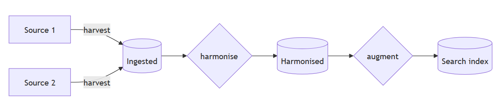

Figure 1 A schematic overview of the flow through the catalogue

## Who should read this manual?

This manual is written for non-technical experts who want to understand and use the SoilWise platform. It is not a system administration or deployment guide; configuration, installation, API documentation, and harvester setup are covered in the SoilWise Technical Documentation, available at [https://SoilWise-he.github.io/SoilWise-documentation/](https://soilwise-he.github.io/SoilWise-documentation/)

- The primary audience is the staff of the European Soil Observatory (EUSO) at the Joint Research Centre (JRC), who will take over and operate the SoilWise Catalogue at the end of the project. Secondary audiences include: **Mission Soil project participant**s, researchers, project coordinators, and data stewards from current and former Horizon and FP-funded soil projects, who can use this manual to understand how their project outputs are surfaced in SoilWise and what they can do to improve their visibility;
- **Living Lab participants,** the people taking part in the Mission Soil Living Labs, who can use this manual to understand what SoilWise offers them, both as a source of soil knowledge and as a destination for the data they generate;
- **Policy makers,** policy officers at European, national, regional, and local level, who can use this manual to understand what kinds of soil evidence the platform makes available and how to filter for the resources most relevant to a given policy question;
- **SoilWise consortium partners,** members of the SoilWise consortium working on related work packages or components, who can use this manual as a shared reference and as a basis for explaining the project to external audiences.

**Any other interested reader working on soil health, data sharing, or data stewardship.** Some sections, particularly those covering the Data and Knowledge Administration Console and the validation and monitoring workflows, describe functionality intended for platform operators and JRC staff rather than everyday users. These are included for completeness and to support the project handover, but end users can skip them without loss of continuity. Readers who want technical depth, exact data models, API endpoints, software libraries, deployment details, should consult the SoilWise Technical Documentation, available at [SoilWise-he.github.io/SoilWise-documentation](https://soilwise-he.github.io/SoilWise-documentation/).

## How to use this document

The manual is organised so that readers can either read it linearly or jump to the section most relevant to their question:

- **Chapter 2, How SoilWise works** describes, in a single narrative, the end-to-end journey of a piece of soil metadata from its publication on a remote repository through to its display in the SoilWise Metadata Catalogue (SoilWise Finder) or its use by the Soil Companion. Readers who want a single mental model of the whole platform should start here.
- **Chapter 3, The thirteen components** describes each of the thirteen platform components in plain language ,what it does today, why it exists, who interacts with it, and what is planned by the end of the project. Readers can read this chapter in full or use it as a reference to look up a specific component.
- **Chapter 4, Using SoilWise** presents four practical workflows: searching the catalogue, asking the Soil Companion, publishing your soil data to SoilWise, and administering the catalogue. Readers who want to use SoilWise hands-on should start here.
- **Chapter 5 and the closing sections** summarise the manual and point to the next steps, including the handover to JRC/EUSO and where to find further information.

# How SoilWise works: the journey of a soil resource

This chapter follows a single piece of soil information from the moment it is published on a remote repository to the moment it is shown to a user of the SoilWise Catalogue (see Figure 3). The aim is to give the reader a single mental model of the platform before the next chapter goes into the details of each of the thirteen components.

## A worked example: a Mission Soil dataset finds its way to a user

Imagine that a Mission Soil project has just produced a new dataset on soil organic carbon stocks in Spanish olive orchads (_SoilOlive_). The project's data manager publishes the dataset on Zenodo with a permanent identifier (a DOI), a title, an abstract, a licence (Creative Commons BY 4.0), the geographic extent, the relevant keywords, and a reference to the Horizon Europe grant that funded the work ([Funding information | Zenodo](https://help.zenodo.org/docs/deposit/describe-records/funding/))[^2]. From this moment on, the dataset is publicly findable on Zenodo, but only by readers who already know to look there. SoilWise's role is to make sure the dataset also surfaces for the much larger group of people who do not — and to bring it together with other, dispersed data and knowledge relevant to a user's topic of interest, such as soil organic carbon stocks or sustainable soil management in olive farming. In doing so, SoilWise helps the data provider reach a wider audience while giving end users a single, unified entry point to everything relevant to their question.

#### Step 1 , Harvesting

At regular intervals SoilWise's Harvester component retrieves information from a set of major European aggregators, OpenAIRE, CORDIS, the INSPIRE Geoportal, data.europa.eu, The Mission Soil Projects and other soil research funded projects ([ESDAC](https://esdac.jrc.ec.europa.eu/projects/Eufunded/Eufunded.html)), as well as a curated list of repositories and edge-of-scope sources (ISRIC, FAO, EEA). To avoid processing the same information repeatedly, the Harvester collects only information that is new or updated (changed) since the last time it checked these sources.

Because the example SoilOlive dataset carries a DOI and references the project's Horizon Europe grant, OpenAIRE will aggregate it and link it to that grant, but not immediately: OpenAIRE refreshes its catalogue in periodic cycles, so a dataset can take from a few weeks up to a couple of months to surface there with its funding link in place. Only once that has happened can the SoilWise Harvester fetch the record, on its next run, into an internal staging area. (See Section 4.1, page 17, for how this timing works.). The image below shows the dashboard for administrators on which they monitor the progress of the harvesting tasks.

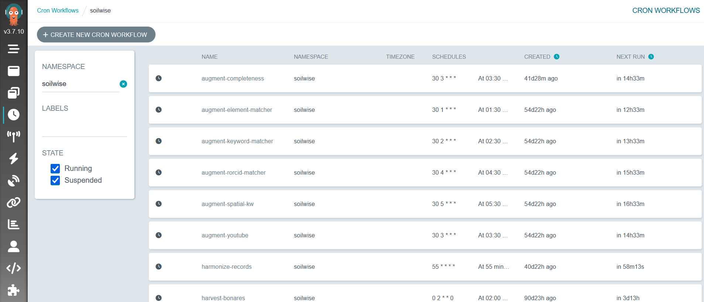

Figure 2 Dashboard view of the scheduled harvester and augmentation workflows.

#### Step 2 , Harmonisation

Different repositories describe their content using different metadata standards: Zenodo uses DataCite, INSPIRE uses ISO 19115, data.europa.eu uses DCAT, and so on. The Metadata Harmonisation step takes the freshly harvested record and translates it into a single common user-oriented SoilWise data model, regardless of the original source format. Where the same dataset appears in more than one place (for example, in both OpenAIRE and the INSPIRE Geoportal), the harmonisation step also merges the duplicate entries into a single coherent record, preserving the links back to the original sources.

#### Step 3 , Validation

Once harmonised, the record is checked for completeness and standard compliance by the Metadata Validation component. Two checks are run in parallel: a completeness score (how many of the essential metadata elements are populated, title, abstract, author, date, type, licence, geographic and temporal extent), and an INSPIRE compliance check for the records that claim to follow INSPIRE. The validation results are stored alongside the record and are visible only to administrators through the Data and Knowledge Administration Console, where they help identify quality issues that might need follow-up with the data provider.

#### Step 4 , Augmentation

In many cases, the harvested metadata is incomplete or uses inconsistent, not well documented, vocabularies and codelists. The Metadata Augmentation component fills in some of these gaps automatically: it matches the record's keywords against the SoilVoc vocabulary \[see also Section 4.5, page 26\] (adding standardised concept identifiers and multilingual labels), it normalises the resource type and language values to a consistent set, it checks whether the links in the record are still alive, and it extracts geographic information from the title and abstract when explicit spatial metadata is missing. The augmented values are stored separately from the original metadata so the two can always be distinguished and shown to the user in a transparent way.

#### Step 5 , Storage and indexing

The processed record is stored in three parallel data stores.

- A relational database (PostgreSQL) holds the raw and augmented metadata in a structured form.
- A triple store (Virtuoso) holds the same record as part of the SoilWise metadata knowledge graph (linked semantically to soil vocabularies and ontologies via SoilVoc — distinct from the Soil Health Knowledge Graph).
- A search index (Apache Solr) holds an optimised, denormalised copy of the record.

Each of these stores supports a different kind of question: structured queries through the database, semantic reasoning through the triple store, and fast full text search through the semantic based index.

#### Step 6 , Discovery through the SoilWise Finder

A researcher visits catalogue.SoilWise-he.eu, types "soil organic carbon Spain" into the search box, and applies a filter for resource type "Dataset" and geographic scope "Spain". The Finder queries the Solr index, ranks the results by relevance[^3], and displays a paginated list. The example dataset appears in the results with its title, a short abstract, a small map showing its geographic coverage, and a badge showing it is openly licensed. The researcher clicks the title and lands on the dataset's detail page, where they can read the full abstract, view the original and augmented keywords, see which Mission Soil project funded the work, and follow the DOI link back to Zenodo to download the data.

#### Step 7 , Knowledge Exploration through the Soil Companion

A different user, perhaps a policy officer, asks the Soil Companion, an AI-based chatbot: "What do recent European datasets and studies indicate about soil organic carbon trends in Spanish vineyards, and are there comparable regions elsewhere in Europe?". The Soil Companion is an AI assistant that uses a large language model together with retrieval-augmented generation: under the hood, it queries the same SoilWise catalogue (via Solr), consults the Soil Health KG (Knowledge Graph) for related concepts and regions, and can optionally access external services such as ISRIC SoilGrids for complementary soil property estimates. The assistant retrieves the related metadata records about datasets and publications, as well as full text from documents when available. It then synthesises the information into a coherent conversational response, highlighting key findings, regional similarities, and relevant knowledge gaps, while providing links back to the catalogue detail pages for further exploration.

#### Across the journey: stewardship and integration

Throughout this journey, several components operate quietly in the background. The Repository Storage component facilitates the storage. SoilVoc maintains the soil-domain vocabularies that the augmentation, catalogue and the Soil Companion rely on; the Soil Health Knowledge Graph (SHKG) provides the broader semantic structure of soil-health concepts. The System Usage and Monitoring component tracks the health of every service and the usage patterns of every user. The Access Control component governs who can administer the platform and (eventually) who can authenticate with the Soil Companion. The Data and Knowledge Publication Support tools help soil data providers prepare their data and metadata in a FAIR and SoilWise-friendly way before it is ever harvested \[see also section 4.8, page 33\]. The Dissemination and Guidelines component produces the documents, videos, and templates, including this manual, that help users and providers understand and engage with the platform. And the EUSO Integration component ensures that, before the end of the project, the entire platform can be handed over to JRC and continue to operate as part of EUSO.

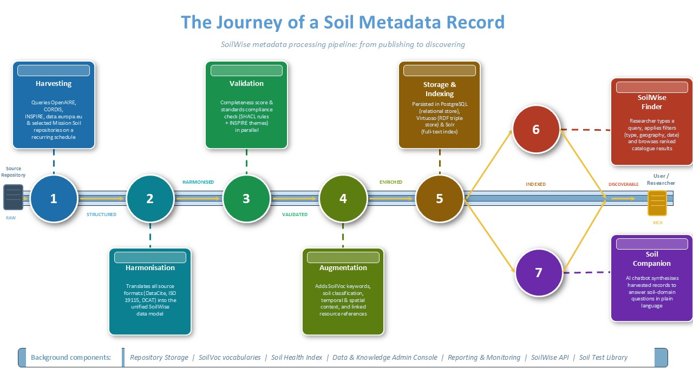

Figure 3 End-to-end flow of a soil metadata record through the SoilWise Catalogue and Soil Companion

# The SoilWise soil information platform - The thirteen components

This chapter describes each of the thirteen SoilWise components in plain language. The components are presented in the order in which they appear along the journey of a soil metadata record (introduced in Chapter 2), starting with the components that bring data into the platform, continuing with those that process and store it, then those that present it to users, and finally those that support the platform's operation and continuity. Each section follows the same structure: what the component does, why it exists, what it does today, who interacts with it, and what is planned for the remainder of the project.

Table 1. The thirteen SoilWise components.

| **Component**                                                                              | **What it does**                                                                                                             |
| ------------------------------------------------------------------------------------------ | ---------------------------------------------------------------------------------------------------------------------------- |
| **Harvester (including Metadata Harmonisation)**                                           | Collects metadata from external repositories and translates it into one common SoilWise model.                               |
| **Metadata Validation**                                                                    | Checks each record's completeness and, where relevant, its INSPIRE compliance.                                               |
| [**Metadata Augmentation**](#comp_augmentation)                                            | Enriches records by standardizing keywords, normalizing codes, checking links, and inferring missing geographic information. |
| [**Repository Storage**](#comp_storage)                                                    | Stores the metadata, the knowledge graph, and the search indexes on which the user-facing tools are built.                   |
| [**Soil-health Knowledge Graph**](#comp_kg)                                                | Captures soil concepts and how they relate to one another across different vocabularies and languages.                       |
| [**SoilWise Finder (the Metadata Catalogue)**](#comp_finder)                               | The main web interface for searching and browsing the catalogue.                                                             |
| [**Soil Companion**](#comp_companion)                                                      | A conversational assistant that answers soil questions in natural language, grounded in catalogue content.                   |
| [**Data and Knowledge Publication Support Tools**](#comp_pubtools)                         | Utilities that help data providers publish FAIR, SoilWise-friendly data and metadata.                                        |
| [**Metadata Authoring**](#comp_authoring)                                                  | A way to create records directly inside SoilWise when harvesting from a repository is not possible.                          |
| [**System Usage and Monitoring (including the Administration Console)**](#comp_monitoring) | Monitors system health and usage and provides the admin dashboard for content oversight.                                     |
| [**Access Control**](#comp_access)                                                         | Manages who is allowed to do what (authentication and authorisation).                                                        |
| [**EUSO Integration**](#comp_euso)                                                         | Packages and validates the platform for handover to JRC/EUSO.                                                                |
| [**Dissemination and Guidelines**](#comp_dissemination)                                    | Produces outreach, guidance, and user materials, including this manual.                                                      |

**Note on the component list.** The thirteen components listed here follow the Cycle 3 roadmap of the SoilWise project. Readers who consult the SoilWise Technical Documentation will find a slightly different structure: in particular, Metadata Harmonisation is described there as a separate component, whereas in this manual it is presented as part of the Harvester section because harmonisation is tightly coupled with the harvesting process. Likewise, the Data and Knowledge Administration Console is described in this manual as part of the System Usage and Monitoring section.

## Harvester (including Metadata Harmonisation)

#### What it does

The Harvester is the entry point of the SoilWise platform from the metadata flow point of view. It is the component that automatically collects (harvests) metadata about soil-related datasets, publications, software, and other knowledge resources from a range of European repositories, on a recurring schedule, and brings that metadata into SoilWise. Once a record has been harvested, the closely linked Metadata Harmonisation step translates it from its original format into the single common SoilWise data model and, where the same record appears in more than one source, merges the duplicates into a single coherent entry.

#### Why it exists

European soil knowledge is published in many places: research data repositories (Zenodo, Dataverse), project information services (CORDIS), spatial data catalogues (INSPIRE Geoportal, ISRIC), open data portals (data.europa.eu), and the websites of individual projects. Crucially, the assets available across these sources span a wide range of types: research datasets, peer-reviewed publications and preprints, project reports and deliverables, geospatial data services, research software, policy briefs, etc. This breadth, a single discovery layer covering data, literature, and services together, is one of SoilWise's core strengths compared to domain-specific repositories that index only one type of output. No single source covers everything, and no two sources describe their content in exactly the same way The Harvester exists to bridge this fragmentation: it harvests metadata records from many sources automatically, on a schedule, so users do not have to know in advance where to look. Where the same resource appears in more than one source, harmonisation merges the duplicate entries into a single, more complete record, preserving the links back to the original sources. The harvester strategy is informing the Dissemination and Guidelines component in supporting data providers to make their records FAIR.

#### What it does today

The harvester is an automated process that runs inside the project's environment. It is scheduled and managed using Argo CronWorkflows, which work in a similar way to GitHub Actions or GitLab pipelines: they automatically start technical tasks without someone having to run them manually. Each pipeline targets one repository or aggregator, asks for records that have changed since the last successful run, and stores the freshly harvested content in an internal staging database from which the rest of the SoilWise pipeline picks it up. The harvesting strategy favours secondary sources (aggregators of multiple primary repositories) over primary sources, to avoid duplicating effort and to benefit from the harmonisation work that the aggregators already perform. Currently harvested sources include:

- OpenAIRE, for DOI-identified research outputs from EU-funded projects;
- CORDIS, for European Research Project information, with a focus on Mission Soil projects;
- data.europa.eu, for open datasets tagged with the keyword "soil";
- INSPIRE Geoportal, for records under the INSPIRE Soil and Land Cover themes, accessed via a dedicated Elasticsearch endpoint;
- Mission Soil project repositories (EJP Soil, Impact4Soil, Islandr, PrepSoil), for outputs from related EU soil projects;
- broader soil and environmental sources (ISRIC, FAO, EEA Geoportal, BonaRes), for authoritative reference data beyond the core Mission Soil scope, harvested with light filtering;
- RSS feeds from project websites listed on the Mission Soil platform, for news items.

**A note on timing.** SoilWise harvests frequently, but a new soil output does not appear in the catalogue the moment it is published. For the major aggregators, OpenAIRE in particular, the limiting factor is the aggregator's own update cycle, not SoilWise's polling frequency. OpenAIRE rebuilds its Research Graph in periodic cycles, and it is during these cycles that a Zenodo record is matched to the EU grant that funded it (the link SoilWise relies on to recognise a record as a Mission Soil output). Two paths run in parallel: a newly published record is picked up quickly by OpenAIRE's incremental indexing, whereas any later edit to that record, most importantly, adding the grant reference after the dataset was first deposited, is only reflected at OpenAIRE's next full re-aggregation, which runs roughly monthly. As a result, a record can take from a few weeks up to a couple of months to become harvestable by SoilWise with its funding link in place. The practical takeaway for data providers is to include the Horizon Europe grant reference (and complete metadata) at the moment of publishing rather than afterwards: a record that is correctly funding-linked from the start is caught in the earliest possible OpenAIRE cycle, while a link added later resets the clock to the next round.

#### Who interacts with it

End users do not interact with the Harvester directly: it runs in the background and its output is what users see when they open the SoilWise Finder or use the Soil Companion. The Harvester is a back-end component, so direct interaction is limited to one maintenance role: the SoilWise Administrator, who monitors the health of the harvesting jobs through Grafana, schedules new pipelines, adjusts filters or endpoints when a source changes, and curates the list of repositories in scope through Github. Below the web interface of Github is displayed, where the configuration of the tasks are managed. Data providers (Mission Soil project data managers, in particular) are an indirect audience: the Harvester helps them making their records discoverable, if they follow the publishing guidelines offered in the catalogue interface.

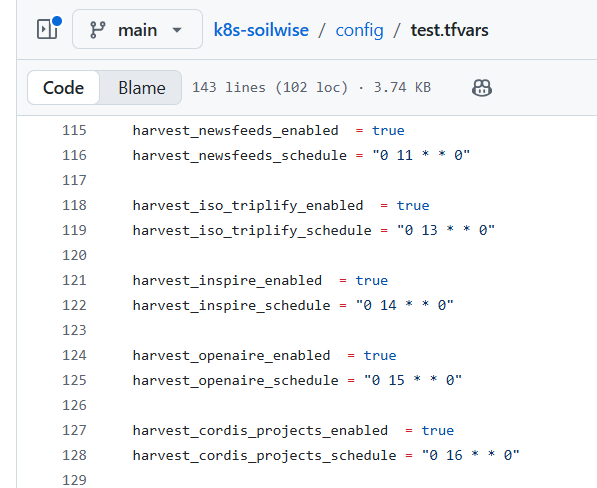

Figure 4 Configuration of the harvesters is managed via a configuration script in the SoilWise Github repository.

#### What is coming next

Two refinements of the harvesting strategy are planned for the remainder of the project. First, for the major aggregators, the team is considering complementing the harvested content with a remote search (querying the aggregator live from the SoilWise interface) or alternatively broadening the harvest using keyword-based queries combined with an automated relevance filter. Second, for primary sources, the scope will be expanded by identifying additional Mission Soil project knowledge hubs and edge-of-scope repositories, in coordination with the Dissemination and Guidelines component which is preparing guidelines for managing knowledge hubs once the projects end. A clear approach for the cases where metadata must be entered manually (rather than harvested) is also being worked out in collaboration with the Metadata Authoring component and the JRC/EUSO.

## Metadata Validation

#### What it does

The Metadata Validation component checks the quality of every metadata record that comes into SoilWise. For each record, it answers to what extent is the record complete, and therefore useful to a SoilWise user.

#### Why it exists

Because SoilWise harvests metadata from many different sources, the quality of the harvested content varies. Some records are rich and complete; others have missing titles, no licence information, no geographic extent, or an outdated link. The Catalogue surfaces all harvested records regardless of metadata quality: no record is suppressed or hidden because of a low score. Validation provides the quality signal that makes this transparent: administrators can see a completeness score for every record, identify systemic gaps across a given source, and prioritise outreach to data providers whose published metadata is consistently below standard. The validation results are currently not used to automatically exclude records from the catalogue, but they can impact the search ranking of a record.

#### What it does today

Validation runs as a recurring pipeline on the SoilWise infrastructure and produces a completeness score for each record. The completeness check uses a weighted scoring system (see Table 2) across twenty one essential metadata fields. The weights are converted into percentages (100% referring to a complete metadata record) using the following formula:

Completeness score = Round ( Σ ( Wᵢ × ( 100 / Wₜ ) ) , 1 )

Wᵢ = The raw weight of a field if it is not empty.

Wₜ = The total sum of all possible weights (170).

Table 2 Scoring indicators for the search functionality

| **indicator**     | **Score (Wi)** |
| ----------------- | -------------- |
| identifier        | 10             |
| title             | 20             |
| abstract          | 10             |
| language          | 5              |
| type              | 5              |
| thumbnail         | 10             |
| date              | 5              |
| datamodel         | 10             |
| subjects          | 10             |
| matched_subjects  | 10             |
| contacts          | 10             |
| accessconstraints | 5              |
| temporal_start    | 5              |
| temporal_end      | 5              |
| spatial           | 10             |
| distributions     | 10             |
| projects          | 5              |
| license           | 10             |
| rights            | 5              |
| format            | 5              |
| lineage           | 5              |

#### Who interacts with it

Validation is primarily a tool for SoilWise administrators and for JRC data analysts: it gives them visibility into the overall quality of the catalogue's content and helps them prioritise outreach to data providers. The picture below shows a diagram within the dashboard. End users of the SoilWise Finder do not currently see validation results directly.

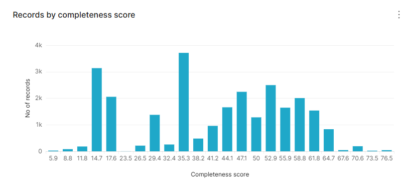

Figure 5 Results of the completeness validation are displayed in an administrator dashboard

#### What is coming next

Two main developments are foreseen both within and beyond the SoilWise project timeframe. First, the completeness check will be refined to take account of the record's resource type (a journal article does not need the same metadata as a dataset), and the scoring will be reviewed in light of what the Metadata Augmentation component is able to fill in automatically. Second, regarding the previously planned INSPIRE compliance validation, a decision was made to halt any further development. This is due to the fact that the European Commission officially abandoned the INSPIRE validation without prior notice. Consequently, INSPIRE validation has been completely dropped from the SoilWise pipeline and the future roadmap.

## Metadata Augmentation {#comp_augmentation}

#### What it does

Metadata Augmentation enriches harvested records by deducting metadata information that was missing, inconsistent, or expressed in a way that is hard for the Catalogue to use. Where the Harvester brings raw metadata in, Augmentation polishes it: matching keywords to standardised vocabularies, normalising language codes, checking that the links point to working resources, and inferring geographic information from the title and abstract when it is not given explicitly.

#### Why it exists

A metadata record harvested from a real-world repository is rarely complete. A keyword may appear as a free-text label in one record and as a vocabulary URI in another; the language of the resource may be encoded as "eng" in one place and "english" in another; a link to a download may already be broken; the geographic coverage may not be filled in at all. With augmentation, we can provide more meaningful and complete filtering options for the user. The augmentation results are stored separately from the original metadata, so the two can always be distinguished.

#### What it does today

Several augmentation processes run on a recurring schedule:

- Keyword Matcher, matches the keywords in each record against the SoilVoc vocabulary, enriched with links to AgroVoc and ISO 11074, in six languages (English, French, German, Italian, Spanish, Dutch). Matches are either exact (by URI) or fuzzy (by label similarity above a threshold of 80).
- Element Matcher, normalises specific metadata fields against curated mapping tables: resource type (e.g., "Journal Article" → "Article"), language code (e.g., "eng" → "en"), and (planned) licence.
- Link Liveliness Assessment, periodically checks every URL referenced in a metadata record and reports whether the resource is still reachable, its file size, and its format. Broken links are flagged for administrator follow-up. For OGC services (WMS, WMTS, WFS, WCS, OGC API) the LLA retrieves service capabilities to extract level-layer metadata such as layer name, bbox, and supporting CRS, matching the specific layer referenced by the metadata record where possible.
- Spatial Metadata Extractor, extracts geographic information from the records. Various mechanisms are used for this purpose and implemented using a phased approach to ensure reliability. An initial process examines the services linked to the records. If this involves an OGC web service, the metadata of these services is checked for spatial information and saved to the catalogue. A second process examines the title and abstract for spatial clues using named-entity recognition and matches these with gazetteers
- RORcider is a tool which verifies PID's of contacts mentioned in metadata. It aims to identify authors by their Orcid and organisation ROR.
- Youtuber is a tool which for any resource identified as being a video on youtube, fetches additional metadata from the youtube platform.
- Zenodo explorer is a component which, for any record identified as being part of Zenodo, fetches additional information, such as the file locations of the actual deposited artifacts.
- PDF extractor is a component which, for every pdf link in metadata, navigates to the pdf and extracts its text content to improve full text search

#### Who interacts with it

Like Validation, Augmentation is largely invisible to end users but its effects are felt directly: the keyword filters in the Finder, the language tags on the detail page, and the geographic previews on the search results all rely on augmented values. SoilWise administrators, and later JRC data analysts who will take over the system, also benefit because they can review enriched values, check uncertain matches, and manage the vocabulary mappings.

To support transparency and trust, SoilWise will provide functionality to trace augmentation steps. Through a dedicated API, the catalogue, administrators and skilled users will be able to retrieve a trace of the augmentation processes applied to a record, including which values were generated, enriched, or matched. This allows stakeholders to better understand how specific metadata elements were derived and to assess their reliability.

#### What is coming next

Several augmentation routes are being added or improved. Keyword extraction directly from the abstract and record's full text (not just the keyword field) is being investigated, in collaboration with the SHKG and SoilVoc components. A spatial scope analyser is in development for records that lack any explicit geographic information. A tagging mechanism for European Soil Observatory High-Value Datasets is being designed with JRC. Across all these routes, a generalised target schema for augmentation data is being designed jointly with the Repository Storage component, and a user-facing display of augmented information is being designed jointly with the SoilWise Finder to provide further insights.

## Repository Storage {#comp_storage}

#### What it does

Repository Storage is where SoilWise keeps everything: the harvested and augmented metadata records, the soil-health knowledge graph, the full text of documents that the metadata records point to, and the indexes that make all of this searchable and query-able. It is the backbone of the platform, on top of all other components are built.

#### Why it exists

The same piece of metadata can be asked very different kinds of questions, and no single storage technology answers all of them well. SoilWise therefore keeps its information in several complementary stores at the same time, each tuned to a different need:

- **exact look-ups and reports**; for example, "list every dataset published in 2024 with an open licence";
- **meaning-based connections between soil concepts**, for example, linking a record to related soil-health concepts and vocabularies so connected knowledge can be explored together;
- **fast keyword and full-text search** across the whole catalogue.

The important point is not the underlying technologies but that each record is stored in whichever forms let users find and use it most effectively. The next section names the specific technology behind each.

#### What it does today

Repository Storage rests on two established open-source stores, with a third being introduced to power search:

#### **PostgreSQL** (a relational database) holds the raw and augmented metadata in structured form. It is the source of truth for the catalogue's content, used both by internal processes and by the catalogue's queries

#### **Virtuoso (a triple store)** holds the same metadata expressed as a knowledge graph, linked to soil vocabularies and ontologies. It supports semantic queries and reasoning through a SPARQL endpoint

#### **A search index (Apache Solr)** is being introduced on top of these stores to provide fast keyword search, faceted search, and ranking over an optimised copy of the metadata, and — once re-enabled — full-text search across linked documents. Planned extensions will add vector-based semantic search to support the Soil Companion

#### Who interacts with it

Repository Storage is a backend component, with no direct user interaction. Its users are the other SoilWise components, the Finder queries Solr, the Soil Companion queries Solr and Postgres, and the metadata knowledge graph (the RDF representation of harvested records) lives in Virtuoso — this is distinct from the Soil Health Knowledge Graph (SHKG). Its human stakeholders are the SoilWise Administrator (who monitors health and performance) and the SoilWise Maintainer (who handles corrective updates to the data model and schema).

#### What is coming next

Two extensions are planned. First, full-text documents, such as PDFs linked from metadata records, will again be stored and indexed; this was temporarily paused while the data model was being refactored. Second, the Solr index will be expanded to store vector representations of document fragments, enabling semantic search and supporting the retrieval-based generation pipeline behind the Soil Companion. The Cycle 3 vision also flags a longer-term option to introduce a dedicated soil vector database if Solr's vector support proves insufficient.

## Soil Health Knowledge Graph and SoilVoc {#comp_kg}

#### What it does

This section covers two distinct but complementary semantic components. The Soil Health Knowledge Graph (SHKG, see Figure 5) is an RDF knowledge graph of soil-health concepts derived with limited manual intervention (semi-automatically) from a curated set of soil-health literature and validated by domain experts. SoilVoc is a SKOS-based soil science thesaurus that links soil properties to measurement procedures and integrates concepts from established vocabularies (AGROVOC, GEMET, GLOSIS, ISO 11074). Together, they form the semantic backbone of SoilWise: SoilVoc enables precise multilingual keyword matching and vocabulary browsing; the SHKG provides the broader conceptual structure that supports semantic search expansion and relation-aware reasoning.

#### Why it exists

Soil science is a domain with a long history of competing vocabularies and terminologies. A property called "soil organic carbon" in one source may be called "SOC", "carbone organique du sol", "Bodenkohlenstoffvorrat", or have a numeric code in another. Without a shared semantic layer, the Catalogue would behave as a string-matching engine and miss many relevant records. SoilVoc addresses this by providing a multilingual, cross-vocabulary controlled vocabulary that the Metadata Augmentation component uses to match and normalise keywords. The SHKG goes further: it captures how soil-health concepts relate to one another, enabling the Soil Companion to reason about related concepts and the Finder to expand search queries to include narrower or related terms.

#### What it does today

The two components are described separately below.

- SoilVoc, a vocabulary on soil concepts and their relationships, integrating concepts from existing soil and adjacent vocabularies (AgroVoc, GEMET, GLOSIS, ISO 11074). SoilVoc is exposed through a public web interface ([SoilWise-he.github.io/soil-vocabs/)](https://soilwise-he.github.io/soil-vocabs/) and used by the SoilWise Catalogue, the Tabular Data Annotator, the SoilWise GeoPackage, and the Soil Companion.
- Soil Health Knowledge Graph is a graph of soil-health concepts derived semi-automatically from a curated set of soil-health resources, then validated by experts. A final version has been published on [GitHub](https://github.com/soilwise-he/soil-health-knowledge-graph) (see Figure 6) and [Zenodo](https://zenodo.org/records/17739174).

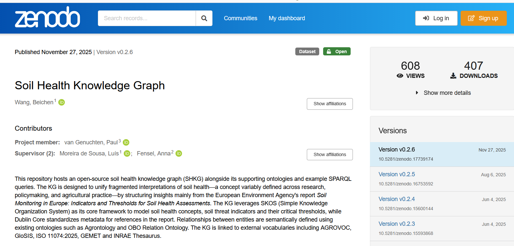

Figure 6 Soil Health Knowledge Graph published in Zenodo

#### Who interacts with it

Both components are primarily backend services, but their outputs reach users in many places. SoilVoc is visible via a public vocabulary browser and its matched keywords appear on each record's detail page and in the Finder filters. Soil scientists, vocabulary curators, and data providers interact with SoilVoc most directly. The SHKG is accessed via a SPARQL endpoint (sparql.SoilWise.wetransform.eu/sparql) and underpins the topical chips in the Soil Companion's Insight panel and semantic query expansion in the Finder; most end users encounter it indirectly through these features.

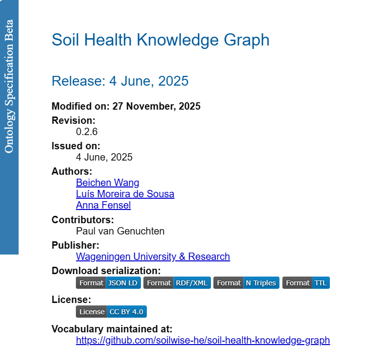

Figure 7 A Visual representation of the knowledge graph is available via github.io

#### What is coming next

Both components are treated as research outputs and are not expected to reach a fully production-ready state by project end. For SoilVoc: the frontend is migrating to a Skosmos-based interface; coverage is being extended to more soil sub-domains; linkage to the SoilWise GeoPackage is under way; and post-project governance and sustainability are being discussed. For the SHKG: the final version (11,719 triples, 2,017 entities) has been published on Zenodo (DOI: 10.5281/zenodo.15596414); ongoing work focuses on improving integration with keyword matching in Metadata Augmentation, query expansion in the Finder, and grounded retrieval in the Soil Companion. Exploration of whether and how the two components should be more tightly linked is also planned.

## SoilWise Finder (the Metadata Catalogue) {#comp_finder}

#### What it does

The SoilWise Finder is the main web interface through which users discover and explore the content of the SoilWise Catalogue. It provides a search box, a set of filters, a map preview, a paginated list of results, and a detail page for each record. The Finder is what most people will see when they think of "SoilWise."

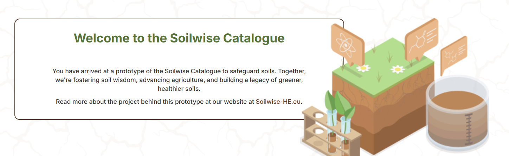

Figure 8 The homepage of the SoilWise Catalogue

#### Why it exists

Even the best-organised catalogue is of limited use if users cannot find what they need. The Finder is the bridge between the SoilWise back-end (the harvested, harmonised, validated, augmented, and indexed metadata) and the user. It translates the structured content of the Catalogue into an interface that lets a soil scientist, a Mission Soil project data manager, a policy officer, or a Living Lab participant find soil resources without having to know how the back-end works.

#### What it does today

The current version of the Finder, accessible at catalogue.SoilWise-he.eu, offers the following core features:

- free-text search across titles, abstracts, keywords, and metadata, with autocomplete suggestions;
- filters by resource type (dataset, document, software, etc.), thematic keyword, source repository, project, license, language, and Mission Soil programme;
- temporal filters (creation date and temporal coverage of the resource);
- spatial filters using countries or regions, drawn bounding box, drawn free-form area, vicinity of the user's location, or geographic name search;
- a detail page for each record with the full abstract, keywords, geographic extent preview, thumbnail, source links, and date of last update;
- a resource preview (geographic extent and, when available, a thumbnail image);
- download of search results to CSV.

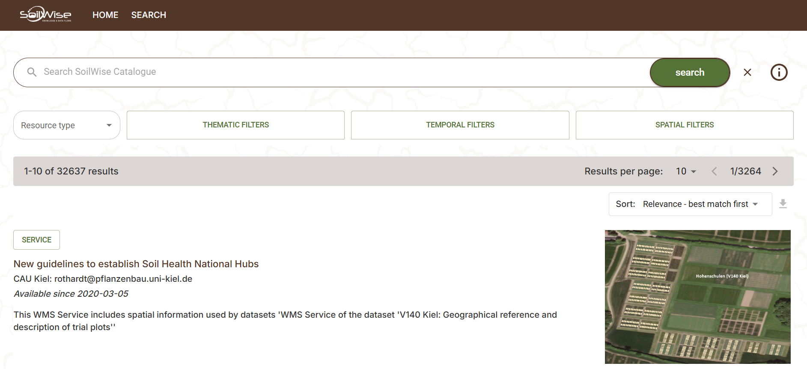

Figure 9 Search options and listing results in the SoilWise Catalogue

#### Who interacts with it

The Finder is the most visible component of SoilWise (see Figure 9) and serves the widest audience: soil scientists and researchers working with European soil health data; Living Lab data scientists looking for catalogued knowledge and publications; Mission Soil Project data managers who want to verify whether their outputs are recognised by SoilWise (and through SoilWise by EUSO); policy makers searching for evidence relevant to a given soil-policy question; and simply anyone interested in soil data and knowledge.

#### What is coming next

Work in the final phase of the project focuses on fine-tuning the Finder's usability, refining filters and ranking strategies, displaying augmented information visibly (matched keywords, translations, spatial augmentations, link-liveliness status), distinguishing original from augmented metadata, and re-implementing full-text search across documents referred to by metadata records. A reanalysis of user expectations based on demonstrations and validation feedback is planned, with intensive coordination with the developers of the augmentation, storage, the harvester, and knowledge graph components. The JRC's role is particularly important here as the UI of the catalogue will be the main interface in the EUSO after the integration.

## SoilWise Companion {#comp_companion}

#### What it does

The Soil Companion (see Figure 10) is a conversational AI assistant or a soil-domain chatbot, that lets users ask questions about European soil data and soil health in natural language. Behind the scenes, it uses a large language model together with the SoilWise Catalogue, a soil knowledge graph, and external soil-data services to give answers that are grounded in actual European soil knowledge rather than in the language model's general training data alone.

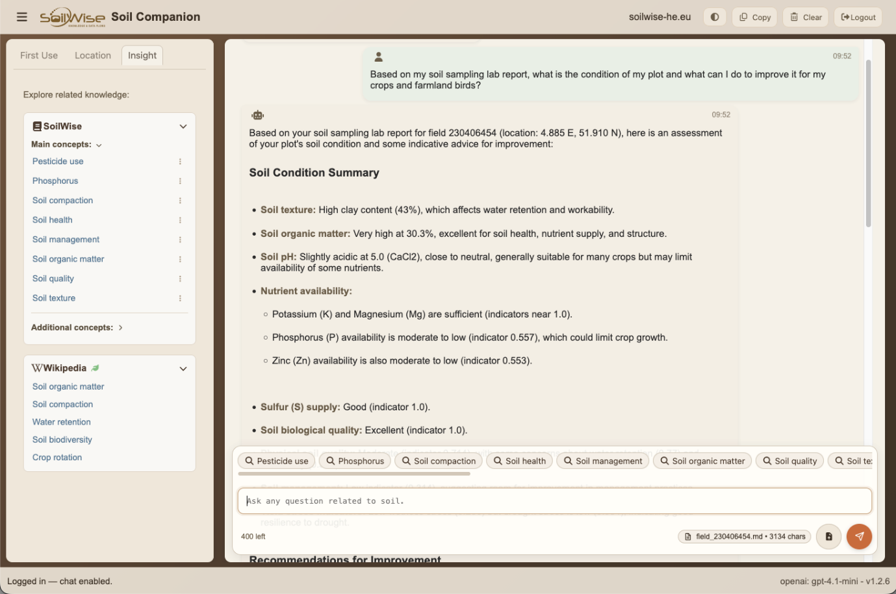

Figure 10. Soil Companion v2 screenshot, showing main conversation area and sidebar presenting Insight links dynamically based on the conversation for further exploration.

#### Why it exists

Many people who would benefit from soil knowledge are not catalogue users by default — land managers and landowners, for example, whose needs shaped the design of the Soil Companion. They do not have time to learn the structure of a search interface or the right keywords to type. A conversational assistant lowers that barrier: a user can ask a plain-language question and get a plain-language answer, with links back to the underlying records they can follow if they want more detail. The Soil Companion also makes it easier to bring together different kinds of information in a single answer, catalogue records, vocabulary terms, soil property estimates, field-level data, in a way that no traditional search interface can match.

#### What it does today

The current version of the Soil Companion is available at [soil-companion.containers.wur.nl/app/index.html](https://soil-companion.containers.wur.nl/app/index.html) and offers the following features:

- natural-language questions in English and Dutch, as well as many other languages, with answers appearing in real time as they are being generated ;
- an autonomous tool-calling mechanism: the assistant decides which sources to consult for each question, including the SoilWise Catalogue, the SoilWise vocabulary endpoint, the ISRIC SoilGrids global soil property service, Wikipedia (in six languages), and the WUR AgroDataCube for Dutch field-level data;
- retrieval-augmented generation from a local set of curated soil knowledge documents;
- automatic enrichment of answers with links to SoilVoc terms and Wikipedia articles, and a sidebar Insight panel showing related vocabulary concepts;
- thumbs up/down feedback that is logged for ongoing quality monitoring.

#### Who interacts with it

The Soil Companion targets a wide audience: soil scientists and researchers looking for catalogued knowledge; agricultural experts and advisors looking for soil-property data and field-level information; educators exploring soil concepts through a conversational interface; policy makers documenting soil health domains, and farmers and land managers in selected regions (currently the Netherlands and Belgium (Flanders), where field-level data is available) who want accessible information on their own fields.

#### What is coming next

The Soil Companion is expected to evolve from a simple chatbot into an integrated soil question-and-answer system that delivers detailed, domain-specific, knowledge-grounded answers on soil health, against a defined set of acceptance criteria. The new version will draw on recent advances in AI engineering: assistants that can plan and carry out multi-step tasks on their own (_agentic AI_), techniques that ground answers in trusted soil sources rather than the model's own memory (_hybrid retrieval-augmented generation, RAG_), and an open standard that lets the assistant connect to external tools and data sources (_the Model Context Protocol, MCP_).

The development focuses on:

1. deeper integration SHKG for semantic retrieval and relation-aware reasoning, and with SoilVoc for vocabulary-grounded keyword expansion;
2. incorporation of geospatial and regional data from available MCP servers to provide more localised and context-aware advice;
3. tighter coupling with Repository Storage using hybrid (lexical/semantic) search on document content, to ensure scientific grounding and richer knowledge retrieval; and
4. integration with the Access Control component to enable unified authentication across SoilWise services.

In addition to the technological and content-related developments, significant attention will be devoted to human evaluation, AI guardrails, and benchmarking of the final system against the established ethical, safety, sustainability, and multilanguage criteria.

## Data and Knowledge Publication Support Tools {#comp_pubtools}

#### What it does

The Data and Knowledge Publication Support Tools are a set of utilities that help people who produce soil data and knowledge to publish it in a way that fits with SoilWise and with the FAIR principles (see Figure 11). These tools are not part of the core catalogue (data flows through them on the way in, not after harvesting), but they make the catalogue's content richer and more interoperable.

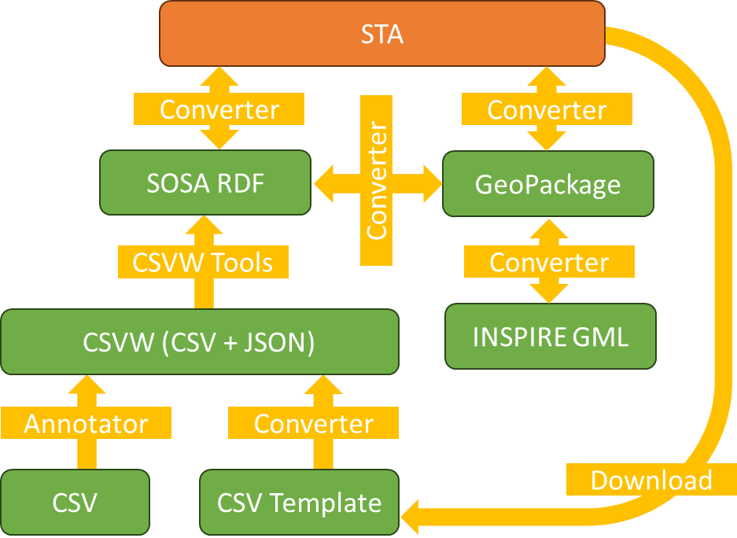

Figure 11 Data format conversion pathways in the SoilWise Publication Support tools.

#### Why it exists

Many of the practical problems of soil data sharing are not catalogue problems: they are publication problems. Soil scientists need to convert between data formats, annotate columns of tabular data with the right vocabulary terms, mint persistent identifiers, and check that their data complies with INSPIRE. Without help with these tasks, much soil data either stays unpublished or is published in a form that is hard for others to reuse. These tools address the practical limits and needs of soil-data FAIRification, with a particular focus on standardisation and annotation of soil properties.

#### What it does today

The following publication support tools are available today:

- Digital Object Identifier (DOI) Resolution Widget, a set of APIs and a small interface (on the SoilWise Catalogue homepage) that allow data providers to check whether DOI is already known to SoilWise, OpenAIRE, or DataCite, and eventually to suggest a new DOI for harvesting.
- Tabular Soil Data Annotation, is a convention to enrich tabular datasets with metadata at table and column level. This metadata supports users (both humans and machines) in understanding the data. A set of tools and guidance documents is provided to create and work with annotated data. The convention builds on the efforts of the W3C [CSV on the Web](https://www.w3.org/TR/tabular-data-primer/) initiative as well as the [Semantic Sensor Network Ontology.](https://www.w3.org/TR/vocab-ssn/)
  - A template in excel, to facilitate creation of metadata alongside the data.
  - A web application (DataAnnotator) that helps users to describe tables and columns of tabular data, supported by optional large language model assistance with vocabulary matching against AgroVoc, GEMET, GLOSIS, and ISO 11074:2015.
  - An API which can generate and transform data model metadata as well as tabular data from a variety of formats.
- SoilWise GeoPackage, an approach to store soil observation data using a standardised relational data model in a single-file container, for collecting, exchanging, archiving and using soil data. The work builds on [INSPIRE Good Practice: GeoPackage encoding of INSPIRE datasets.](https://github.com/INSPIRE-MIF/gp-geopackage-encodings/blob/main/spec/GeoPackage_Good_Practice_initiation_fiche.md) A set of tools and guidance documents is available to work with the proposed GeoPackage:
  - A database template
  - Guidance on how to use the database in QGIS software.
  - Guidance on using the database for field survey via QField.
- Soil Vocabulary Browser, an interactive interface for the SoilVoc vocabulary, providing visibility into soil-domain concepts and their relationships across multiple source vocabularies. In addition to providing Observable Properties required for data annotation, this vocabulary also provides links to applicable Procedures (Methodologies) for determining these Observable Properties.
- Hale Studio, an extract-transform-load tool acknowledged by the SoilWise community for handling complex structured data transformations (XML, relational, tabular), reprojection, and semantic mapping.
- Simple converters transferring data from one serialization to a different one, while maintaining the underlying structure.

#### Who interacts with it

These tools are designed for soil data providers and stewards, typically researchers, data managers in Mission Soil projects, soil scientists working in national or institutional repositories, and Living Lab participants who produce soil data. The aim is to lower the cost of FAIR data management and publication so that more data ends up in the catalogue, with better quality, and so that the providers themselves benefit from clearer documentation and stronger findability.

#### What is coming next

The vision for this set of tools, going forward, is to make them more usable and more connected. Specifically: improving the SoilVoc frontend, extending SoilVoc to cover more soil sub-domains, providing standard mappings in SoilVoc and in Hale Studio, linking the tools to each other (so that, for example, the GeoPackage can read vocabularies directly from SoilVoc), API access to all data via STA, improving user friendliness, and providing example workflows that demonstrate how to use each tool in a real publication scenario.

## Metadata Authoring {#comp_authoring}

#### What it does

Metadata Authoring covers the (relatively rare) situations in which a metadata record needs to be created directly inside SoilWise, rather than harvested from a remote repository. It provides a standardised way to enter, improve, and publish such a record, with support for enhancing the FAIRness of the underlying resource.

#### Why it exists

SoilWise's normal operating mode is to harvest metadata from external repositories. Directly editing existing harvested records would be problematic (authorship, provenance, management of duplicities and access-rights tracking would become complicated). Moreover, Horizon projects are in any case obliged to publish their results publicly in open established repositories once providing non-sensitive information. Manual metadata authoring is therefore a niche scenario, used mostly when a project needs to provide evidence of its results through metadata, but the actual data cannot be published openly, not even as a restricted-access dataset, or when it doesn't fit in the harvesting strategy (eg. a national funded project).

#### What it does today

A standardised metadata template has been completed and validated. Three scenarios are recognised for manual authoring:

- the data is published with complete metadata but not yet in SoilWise;
- the data is published with limited or inaccurate metadata, and the metadata needs to be extended;
- the data is not publishable but a metadata record for reference should still be created.

#### Who interacts with it

The component is used primarily by SoilWise administrators and by selected data providers from projects who fall into one of the three scenarios above. End users of the Catalogue do not interact with this component directly; they see the records it produces alongside the harvested records, with the source clearly indicated.

#### What is coming next

The exact implementation is still under discussion with JRC. Three potential approaches are being evaluated: (1) lightweight metadata tagging, letting users attach tags or annotations to existing harvested datasets without altering the original records; (2) Excel-based ingestion, a structured workflow in which metadata is compiled in a standard Excel template and then imported into the database; and (3) a dedicated metadata editor, a stand-alone interface backed by a separate database for manually authored records, isolating them from the harvested data to avoid provenance conflicts. The metadata-tagging approach is being investigated alongside the Metadata Augmentation component, and the DOI-suggestion functionality offered by the DOI Resolution Widget will be linked to whichever approach is chosen.

## System Usage and Monitoring (including the Administration Console) {#comp_monitoring}

#### What it does

System Usage and Monitoring provides visibility into the operation of the SoilWise Catalogue: how each service is performing, whether all the components are healthy, how the catalogue's content is evolving, and how users are interacting with the platform. It also includes the Data and Knowledge Administration Console, the dashboard through which administrators inspect and manage the catalogue's content. Together, these tools give operators, and eventually JRC stakeholders, real-time insight into the system.

#### Why it exists

Any platform intended for long term use needs monitoring. Without it, problems are discovered by users rather than by operators, and there is no way to measure whether the catalogue is improving over time. The Administration Console gives administrators a single place to inspect content statistics, harvester logs, validation results, and usage figures, which is essential for everyday operations.

#### What it does today

Monitoring is built on an open-source observability stack:

- Prometheus collects health and performance data from every part of the system, checking things like response times and error rates. Grafana turns that raw data into visual dashboards: charts and graphs that let administrators see at a glance whether everything is running smoothly, available at a password-protected web address (grafana.SoilWise.wetransform.eu) for the operations team.
- Loki and Promtail gather and store log records, essentially a running diary of activity across the platform, making it easy to search for unusual patterns, such as a spike in failed requests.
- If something goes wrong, Alertmanager automatically sends a notification to the team's Slack channel (with a PagerDuty integration available for critical environments) so problems are caught quickly, without waiting for a user to report them.
- For the public-facing SoilWise-he.eu website, visitor behaviour (pages visited, time spent, geographic spread) is tracked separately using Hotjar and Google Analytics.
- Finally, the Administration Console is a purpose-built homepage for catalogue administrators. Rather than raw charts, it surfaces the numbers that matter most for day-to-day operations: how many datasets are in the catalogue, how many countries are represented, and how many Mission Soil and Horizon Europe projects have contributed content.
- The Administration Console provides a user-friendly homepage for administrators, with content statistics emphasised over plots (number of datasets, number of countries covered, focus on Mission Soil and Horizon projects).

#### Who interacts with it

The primary audience is SoilWise administrators (right now, the consortium operations team at WeTransform and partners), and in near future, JRC operators after the handover. Mission Soil project data managers may also interact with selected dashboards (for example, to see the SoilWise Finder's reach for their project's outputs). End users do not interact with the monitoring stack.

#### What is coming next

Three directions are in scope. First, the team is discussing with JRC which of the open-source tools (Prometheus, Grafana, Loki, Alertmanager) are compatible with EUSO's infrastructure and operations, and whether any adjustments to the software stack are needed. Second, the migration of the monitoring stack from the WeTransform Kubernetes cluster to the JRC infrastructure is being planned. Third, user statistics are being extended (currently in progress, using either Matomo or Google Analytics) to give a fuller picture of catalogue usage.

## Access Control {#comp_access}

#### What it does

Access Control is the component that decides who can do what on the SoilWise platform. It handles authentication (proving that you are who you say you are) and authorisation (determining what you are allowed to access). At present, access control protects administrative functions; in the future it will also gate user-facing services such as the Soil Companion.

#### Why it exists

Even an open-access catalogue needs access control for its administrative and data-management functions. The Administration Console must be protected from unauthorised access, harvesting jobs should not be triggered by just anyone, and (in the future) the Soil Companion will need to know who is asking a question to personalise the answer and to enforce usage policies. For a platform that will be handed over to JRC, access control also needs to integrate with the European Commission's existing authentication infrastructure.

#### What it does today

Authentication today is handled by a Keycloak instance acting as the central OpenID Connect identity provider, at id.SoilWise.wetransform.eu. Authorisation is based on a five-tier role model:

- anonymous, anyone who arrives at the catalogue without logging in;
- basicUser, a logged-in user with read access to non-public services;
- dataManager, a user able to manage specific datasets and their metadata;
- themeManager, a user able to manage thematic content groupings;
- orgAdmin, an organisational administrator with broader permissions.

#### Who interacts with it

Access Control is invisible to the casual visitor of the catalogue, most of the Finder's content is open and does not require authentication. Its direct users are administrators, data managers, and theme managers. For the platform's long-term operations, the most important stakeholder is JRC, which will need the platform to integrate cleanly with EU Login.

#### What is coming next

The principal upcoming change is the integration of EU Login (the European Commission's central authentication service, also known as ECAS) as an additional identity provider, so that European public sector users can access SoilWise services with their existing EU Login credentials and without creating a separate account. Authentication for the Soil Companion will also be brought under the same access control mechanism. Beyond that, mechanisms for data access and usage control following the EC Data Spaces concept of data sovereignty are being scoped in discussion with JRC.

## EUSO Integration {#comp_euso}

#### What it does

EUSO Integration covers the preparation, packaging, and validation work needed for the core SoilWise components to be operable inside the European Soil Observatory at JRC. It is the component that ensures continuity of soil knowledge infrastructure beyond the lifetime of the SoilWise project. Not all thirteen components are expected to be handed over: the scope of the handover and which components transfer, which are retired, and which may continue as separate services, is being agreed upon with JRC and the consortium partners.

#### Why it exists

SoilWise is a four-year innovation action project. Its scientific and technical outputs would be of limited value if the platform itself stopped running on 31 August 2027, or shortly after. The EUSO Integration component is the project's answer to this risk: it packages, documents, and validates the platform so that JRC can take it over, operate it, and extend it independently within the EUSO environment.

#### What it does today

Currently, all SoilWise components are hosted on the WeTransform Kubernetes cluster as a Test environment (SoilWise.wetransform.eu). The deployment approach is well established on the SoilWise side: all components run in containers, and deployments are automated and reproducible. The immediate next step is the move to a Production environment on dedicated WeTransform infrastructure (soillive); the subsequent migration to the JRC environment is being planned in active discussion with JRC, and the precise form of the handover is still being determined.

- all components are containerised and orchestrated on Kubernetes;
- in all components are configured through version-controlled scripts, supporting reproducible deployment on the SoilWise infrastructure;
- the test environment is currently the main running instance, with the Production environment being prepared.

#### Who interacts with it

EUSO Integration is a stewardship component: its key stakeholders are the Joint Research Centre (which will operate the platform after handover), the SoilWise consortium operations team (which is currently running the platform), and the European Commission funding service (which has an interest in the durability of the project's results).

#### What is coming next

The remaining work is structured around three steps. First, all components are being moved to the Production environment (soillive), which is under way. Second, JRC hosting requirements are being clarified through direct discussions: JRC is examining Kubernetes, but the existing JRC infrastructure has a single-host, non-root constraint that makes a standard Kubernetes deployment difficult; k3s (a lightweight Kubernetes distribution) is being proposed as an alternative that can run under these constraints. Third, the handover timeline and scope are to be agreed with JRC, with initial agreement expected in early July 2026; the final handover documentation will describe which components transfer, the operational model, and support arrangements.

## Dissemination and Guidelines {#comp_dissemination}

#### What it does

The Dissemination and Guidelines component cover the activities, resources and support material that help different user groups understand, use, and reuse the SoilWise Catalogue, the wider knowledge infrastructure and its underlying soil data. Supporting both outreach and uptake, it includes guidelines and documentation for data providers, capacity-building materials for the Mission Soil community, and end-user resources such as this manual.

#### Why it exists

A knowledge platform is only useful if its target users know that it exists, understand what it offers, and can engage with it in practice. The SWR aims not only to collect and connect soil-related data and knowledge, but also to make these resources visible, reusable, and understandable for different communities. The Dissemination and Guidelines component therefore plays a bridging role between the technical infrastructure and its users, ensuring that SoilWise outputs reach the right audiences (soil scientists, project data managers, Mission Soil Living Labs, policy makers, the wider Mission Soil community). The guidelines ensure that data providers know how to publish their work in a way that makes it easily descoverable in SoilWise and in EUSO. In this way, the component supports the long-term uptake, visibility, and sustainability of SoilWise outputs beyond the project itself.

#### What it does today

A diverse set of materials has already been produced across multiple formats and platforms:

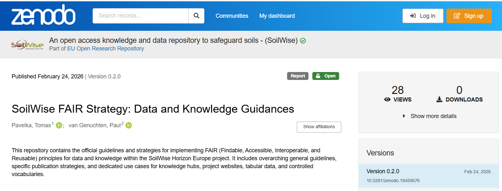

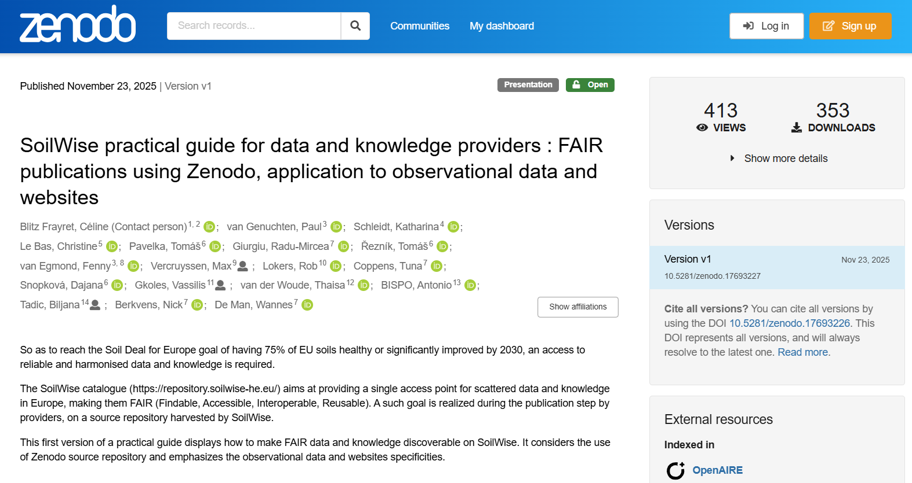

Figure 12 FAIR data strategies and practical guides: [link1](https://zenodo.org/records/19450676), [link2](https://zenodo.org/records/17693227)

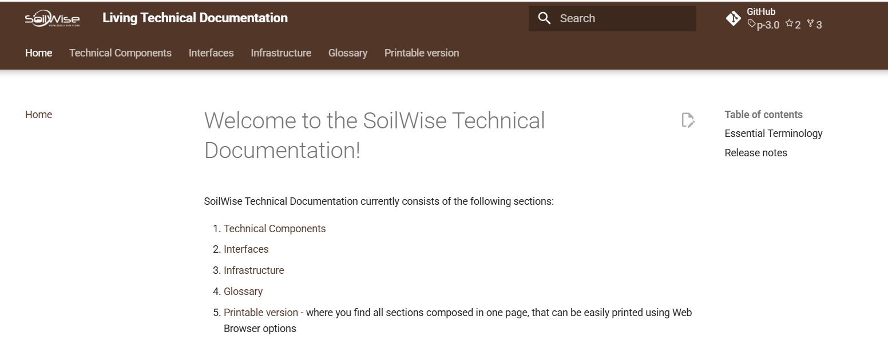

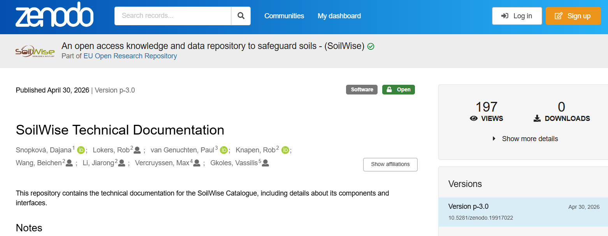

Figure 13 Technical documentation hosted on GitHub and Cloudflare Pages; [link1](https://main.soilwise-documentation.pages.dev/), [link2](https://zenodo.org/records/19917022).

**Guides and manuals**

- User-facing manuals, including this manual

**Outreach and communication materials**

- Flyers, factsheets, and short overview documents (see Figure 15)
- Project-level communication materials available through the SoilWise website ([https://SoilWise-he.eu/](https://soilwise-he.eu/)) including outreach content presented at events and on-demand materials distributed through the project's communication channels

**Multimedia and presentations**

- Videos, webinars, and presentations, such as the Geopackage demo on [Zenodo](https://zenodo.org/records/19632096) or the webinars recordings published on [Youtube](https://zenodo.org/records/19632096).

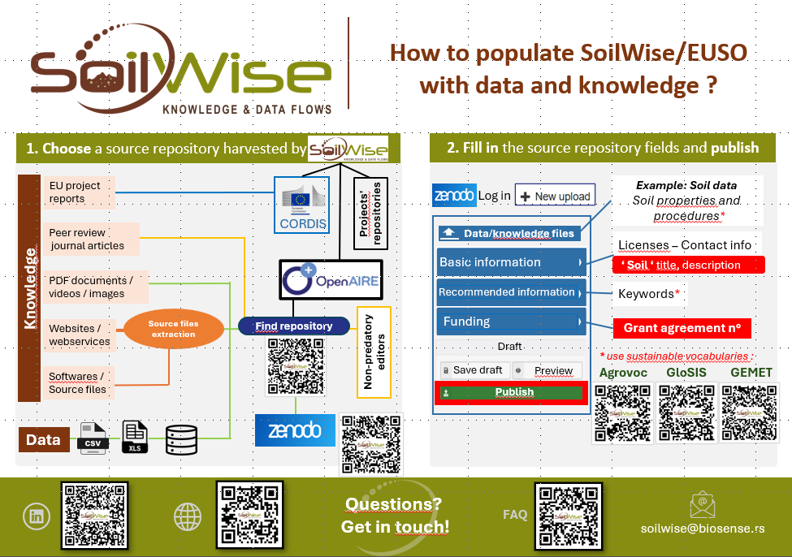

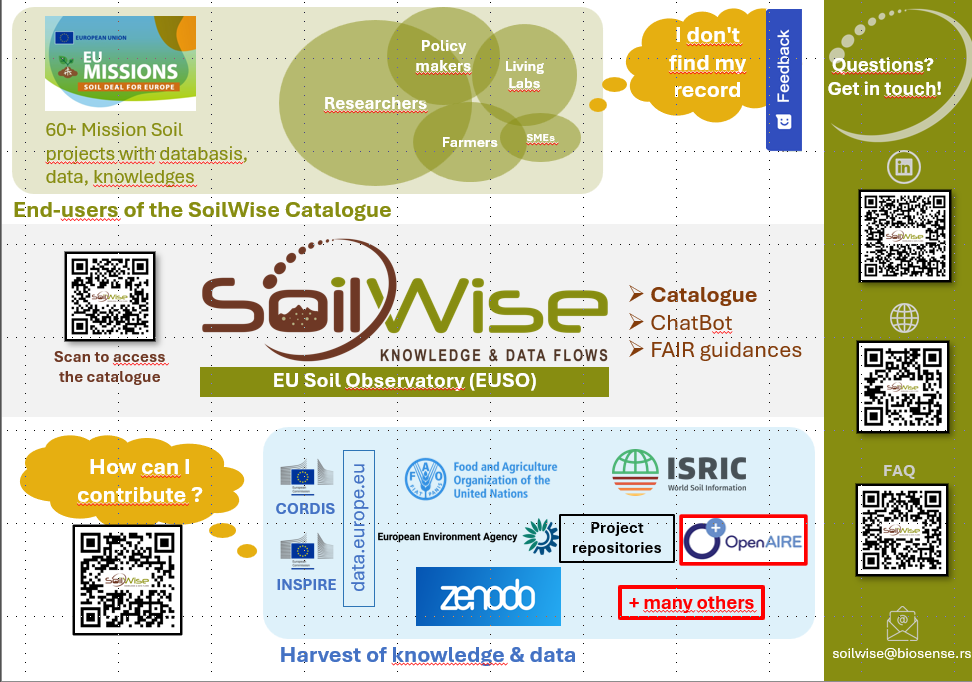

Figure 14 Postcard targeting data providers and _users_

#### Who interacts with it

The audience for Dissemination and Guidelines is broad: it covers the same groups as the rest of the platform (data and knowledge providers, Mission Soil partners, data managers, project participants, policy makers, researchers and soil scientists, JRC) and adds the wider Mission Soil community, the press, the academic soil-science community, and the general public.

#### What is coming next

Three problems are being addressed in the remainder of the project. First, some topics frequently asked by Mission Soil users are not yet covered by the documentation (for example, "How do I make my source code discoverable on SoilWise?", or a flyer explaining how a project's data and knowledge become discoverable in SoilWise and reach EUSO). Second, several documents are hard to find or have not been formally published. Third, the documentation is not yet well linked from the SoilWise landing page. The solutions in progress include publishing or listing DOIs of the most useful documents for the soil community, archiving the SoilWise website on Zenodo, categorising documents by resource type and support type, and reorganising access to all materials from the SoilWise landing page. This manual itself is one of the deliverables of this component.

# Using SoilWise: practical walkthroughs

This chapter walks through four typical interactions with the SoilWise Catalogue. The first two are about finding things (the Finder, the Soil Companion); the third is about publishing things (preparing your soil data and metadata for SoilWise); and the fourth covers light administration tasks for readers who help operate the catalogue.

## Searching the catalogue with the SoilWise Finder

The Finder is available at [catalogue.SoilWise-he.eu](https://catalogue.soilwise-he.eu/). The fastest way to get a feel for it is to follow this short workflow.

- **1\.** Open the Finder in a browser. The home page presents a single search box and a panel of filters on the left.
- **2\.** Type a keyword ("soil organic carbon", "erosion", "Mission Soil") or a short phrase in the search box and press Enter. Use double quotes to search for an exact phrase.
- **3\.** Narrow the results using the filters on the left: resource type (dataset, document, software), thematic keyword, geographic scope, temporal coverage, licence and access, and source repository. Filters in different categories combine with AND; multiple selections within one category combine with OR.
- **4\.** Sort the results by relevance (the default for keyword searches), by date (newest first), or alphabetically by title.
- **5\.** Click a result's title to open its detail page. The detail page shows the full abstract, the keywords, the geographic extent (with a map preview when available), the dates and version, the licence, the DOI or persistent identifier, the links to the source repository.
- **6\.** Click on the link and enter the source repository where you can follow the respective steps to download the data or other resource.

**Worked example: finding open datasets on soil health in Spain**

Suppose a researcher wants to find open datasets related to soil health in Spain. The search process could work as follows:

**Start with a broad search term.**

The researcher opens the SoilWise Finder and types **"soil health"** in the search box. This returns a broad list of catalogue records related to soil health, including datasets, reports, publications, and other resources.

**Limit the results to datasets.**

To focus only on data resources, the researcher applies the filter **Type → Dataset**. This removes publications, reports, software, and other non-dataset resources from the results list.

**Narrow the search geographically.**

The researcher then applies the geographic filter **Geographic scope → Spain**. The results now show only records that are linked to Spain, either because Spain is included in the original metadata or because SoilWise has inferred the geographic coverage during metadata augmentation

**Filter for openly reusable data.**

To find data that can be reused under clear conditions, the researcher applies the licence filter, for example **Licence → CC BY**. This helps identify datasets that are openly licensed and can be reused with proper attribution.

**Review the most relevant results.**

The researcher keeps the default sorting by **Most relevant**, so records that best match the search term and selected filters appear first. They scan the result titles, short descriptions, dates, licences, and available previews to identify promising datasets (see Figure 16).

**Open a record detail page.**

The researcher clicks on a promising result. The detail page shows the available metadata, including the title, abstract, keywords, geographic coverage, license, dates, source repository, and any available links. The metadata panel helps the researcher decide whether the dataset is relevant before leaving the SoilWise Catalogue.

**Access the original dataset.**

Once the researcher has identified a relevant dataset, they follow the link from the SoilWise detail page to the original source repository, such as Zenodo (see Figure 17) or another harvested repository. From there, they can access, download, or cite the dataset according to the conditions set by the data provider.

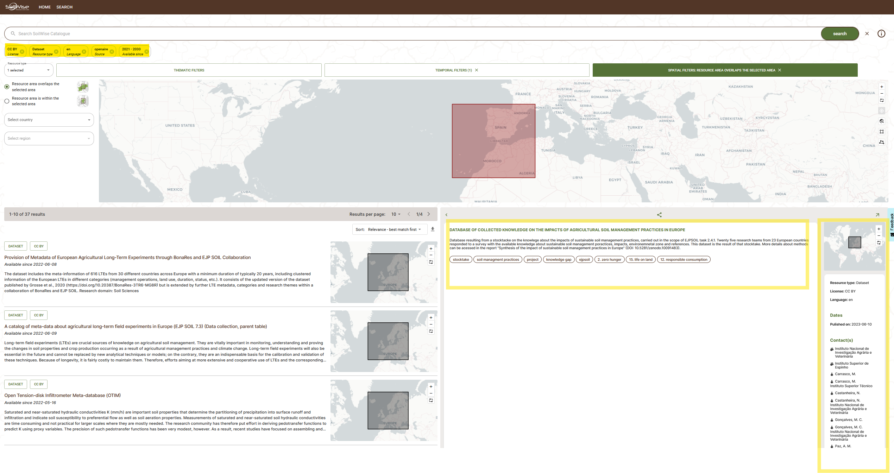

Figure 15 Example of applied filters in a search on the catalogue

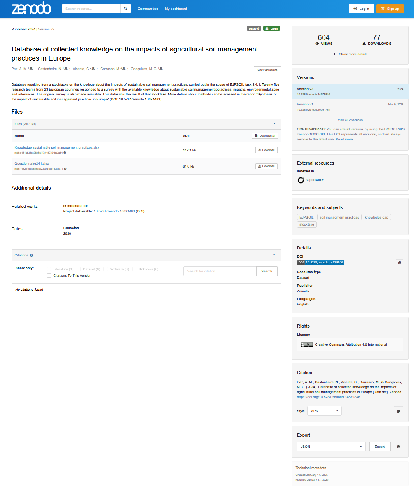

Figure 16 The dataset found through SoilWise accessed on the source repository (Zenodo)

## Asking the Soil Companion

The Soil Companion is available at [soil-companion.containers.wur.nl/app/index.html](https://soil-companion.containers.wur.nl/app/index.html), and accessible from the home page of the UI. The login credentials of the Soil Companion are received on demand. Unlike the Finder, the Soil Companion accepts plain-language questions and synthesises answers from multiple sources, including the SoilWise Catalogue, the SoilWise vocabulary, ISRIC SoilGrids, Wikipedia (in six languages), and (for Dutch fields) the WUR AgroDataCube.

A typical interaction looks like this:

- **1\.** Open the Soil Companion in a browser. A chat interface appears, with an Insight panel on the side that will populate with related vocabulary concepts as the conversation develops.
- **2\.** Type a question in English or Dutch , for example, "What recent European datasets are available on soil organic carbon in Spanish vineyards?" or "What is the typical pH range for Mediterranean vineyard soils?".
- **3\.** Watch the answer stream in token by token. The Soil Companion decides which tools to call (catalogue search, vocabulary lookup, soil-property estimates) and synthesises a single answer.
- **4\.** Follow the auto-generated links in the answer ,to SoilWise records, to vocabulary terms, to Wikipedia articles ,to dig deeper.
- **5\.** Click thumbs up or thumbs down on each answer to give feedback, or indicate further feedback such as inappropriate, not relevant etc.. The feedback is logged and helps the project monitor the quality of the assistant.

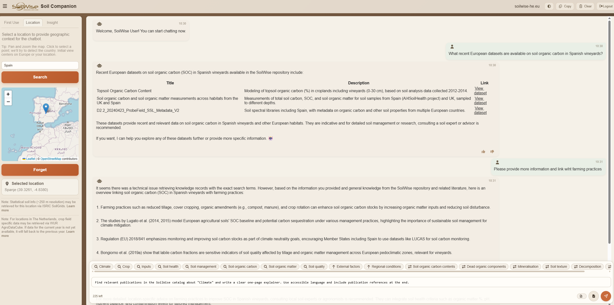

Figure 17 Example of finding SoilWise resources through the SoilCompanion

#### Limitations to be aware of

The Soil Companion's answers are grounded in the available sources but can still contain inaccuracies. Quantitative estimates from ISRIC SoilGrids are modelled at roughly 250-metre resolution and are not a substitute for field measurements. Field-level data is currently available only for the Netherlands. The Soil Companion will tell you when a question is out of scope or when it cannot find a grounded answer.

The SoilCompanion does not intend to compete in any way with the commercial LLMs. It does use (for now) Open Ai LLM and it aims to make the information from the catalogue more available in natural language. You can see the soil companion as the conversational alternative to scrolling to the catalogue. The chatbot is built with trust and transparency principles, indicating the sources and avoiding a block box generated answer.

## Publishing your (Mission) soil data to SoilWise

SoilWise does not host data directly; it harvests metadata about data that is already published elsewhere. The most reliable way to make sure your soil data and knowledge surface in SoilWise is to publish them in one of the repositories that SoilWise harvests, with good-quality metadata.

- **1\.** Publish your dataset on Zenodo (the recommended repository for soil datasets) or on another repository that is harvested by OpenAire or data.europa.eu, with a persistent identifier (DOI), a clear title, abstract, authors, a Creative Commons or similar licence, a list of keywords (preferably from a recognised vocabulary), and the geographic and temporal extent of the resource.
- **2\.** Reference the Horizon Europe grant agreement number in the metadata. This is how SoilWise (via OpenAIRE and the ESDAC project list) recognises that the dataset comes from a Mission Soil project.
- 3\. For optimal interoperability, identify and adopt a relevant community standard for your data. For soil observation data, the [observations, measurements & samples](https://www.ogc.org/standards/om/) standard of Open GeoSpatial Consortium empowers various relevant initiatives (ISO28258, INSPIRE Soil, FAO GLOSIS). In SoilWise we facilitate 2 interoperability conventions from that community:
  - **3a.** If your dataset is in a file based tabular (csv, dbf, excel), use the [Tabular Soil Data Annotation](https://dataannotator-swr.streamlit.app/) tool (DataAnnotator) to add semantic descriptions to your table columns or grid dimensions. The tool helps you match descriptions to standard vocabularies. The generated metadata can be uploaded with the data to Zenodo. Use the SoilWise API to serialize annotated tabular data to rdf, geopackage or GML.
  - **3b.** If your data is stored in a relational database (postgreSQL, oracle), consider exporting it at intervals in the SoilWise GeoPackage format. The GeoPackage faithfully follows the INSPIRE Soil conceptual model and includes pre-configured editing forms for use in QGIS.
- **4\.** Once your dataset has been published, after a while, you can use the DOI Resolution Widget on the SoilWise homepage to check whether OpenAire and SoilWise have already harvested it. Keep in mind harvesting is done at regular intervals, and there might be a delay from the publishing to the source repository to finding it in SoilWise.

## Administering the catalogue

Administrators of the SoilWise Catalogue do not edit metadata records directly. Instead, they configure and monitor the harvesters that bring records into the platform. Three kinds of administrative activity can be identified:

- **1\.** Scheduling and monitoring harvester, harmonize, validation and augment tasks, each task is managed in a configuration file which is maintained in a private GitHub repository. Administrators can login to GitHub to update the configuration file. Post change events (GitHub Actions) trigger an update of the Kubernetes cluster to reflect the updated configuration. Dashboards (Argo workflows and Grafana) have been set up to monitor the progress of scheduled pipelines.
- **2\.** Creating and adjusting harvester tasks, adding a new source, changing a filter, or updating an endpoint. The configuration lives in the harvester repository on GitHub.
- **3\.** Creating and adjusting harvester types, when a new kind of repository needs to be harvested for the first time, dedicated code is added to the harvester repository.

Administrators also use the Data and Knowledge Administration Console (see 4.11) for content-level oversight: viewing statistics, inspecting validation results, and following up on quality issues. After the EUSO handover, JRC operators are expected to take on these tasks. A more detailed administrator's reference is available in the SoilWise technical documentation.

# Conclusions and what comes next

This User Manual V1 has presented the SoilWise Catalogue in plain language, from the perspective of the people who use it and the people who will operate and maintain it in the future. It described the platform's purpose, the journey of a soil metadata record through the system, the role of each of the thirteen components, and four practical workflows for using the catalogue today.

The platform described here corresponds to the third project prototype (delivered in month 32 of the project). Substantial work remains for the fourth and final prototype and for the handover to the Joint Research Centre before the closing months of the project. The component-by-component "What is coming next" sub-sections in Chapter 3 summarise the main planned developments; the most strategic of these are: the final integration into the European Soil Observatory environment, the completion of metadata augmentation and linkage to controlled vocabularies and knowledge graphs, the integration of EU Login for unified authentication, and the completion of the dissemination and guidelines work that this manual is part of.

Beyond August 2027, the SoilWise Catalogue is intended to live on as part of the European Soil Observatory at JRC. The aim of this manual, and of the project as a whole, is to make that transition as smooth as possible: for JRC and EUSO staff who will operate the platform, for the Mission Soil community that will continue to feed it with data and knowledge, and for the wider audience of European soil scientists, policy makers, Living Lab participants, and citizens who may benefit from the information it provides.

For further information, readers are referred to: the SoilWise project website at [SoilWise-he.eu](https://soilwise-he.eu/), the technical documentation at [SoilWise-he.github.io/SoilWise-documentation](https://soilwise-he.github.io/SoilWise-documentation/), the public catalogue at [catalogue.SoilWise-he.eu](https://catalogue.soilwise-he.eu/), the Soil Companion at [soil-companion.containers.wur.nl](https://soil-companion.containers.wur.nl/app/index.html), the SoilVoc vocabulary at [SoilWise-he.github.io/soil-vocabs](https://soilwise-he.github.io/soil-vocabs/), the source code on GitHub at [github.com/SoilWise-he](https://github.com/soilwise-he), and the project's releases on [Zenodo](https://zenodo.org/communities/soilwise-he/records?q=&l=list&p=1&s=10&sort=newest).

[^2]: SoilWise practical guide for data and knowledge providers : FAIR publications using Zenodo, application to observational data and websites, <https://zenodo.org/records/17693227>

[^3]: **How results are ranked.** When a user runs a free-text search, the Finder returns results ordered by relevance. Relevance is computed by the underlying search index (Solr): a record ranks higher when the search terms appear more frequently within it, when those terms are comparatively rare across the catalogue as a whole (a distinctive term is a stronger signal than a common one), and when the match occurs in a short, prominent field such as the title or keywords rather than deep in a longer field. Users can override this default ordering and sort instead by other filters.