# Practical-guide-providers-V1

- Source PDF: `Practical-guide-providers-V1.pdf`
- Rendered pages: 38
- Generated by: `pdf-to-images/process_inbox.py`
- Peristent link: [10.5281/zenodo.17693226](https://doi.org/10.5281/zenodo.17693226){target="_blank" rel="noopener noreferrer"}

## Editorial summary

So as to reach the Soil Deal for Europe goal of having 75% of EU soils healthy or significantly improved by 2030, an access to reliable and harmonised data and knowledge is required. 

The SoilWise catalogue (https://repository.soilwise-he.eu/) aims at providing a single access point for scattered data and knowledge in Europe, making them FAIR (Findable, Accessible, Interoperable, Reusable). A such goal is realized during the publication step by providers, on a source repository harvested by SoilWise. 

This first version of a practical guide displays how to make FAIR data and knowledge discoverable on SoilWise. It considers the use of Zenodo source repository and emphasizes the observational data and websites specificities.

## Video walkthrough
***[PLACEHOLDER FOR DOI](https://en.wikipedia.org/wiki/Digital_object_identifier)***

<iframe
  width="560"
  height="315"
  src="https://www.youtube-nocookie.com/embed/CBXY5ZT42SY"
  title="YouTube video player"
  frameborder="0"
  allow="accelerometer; autoplay; clipboard-write; encrypted-media; gyroscope; picture-in-picture; web-share"
  referrerpolicy="strict-origin-when-cross-origin"
  allowfullscreen>
</iframe>

## Page images

### Page 1

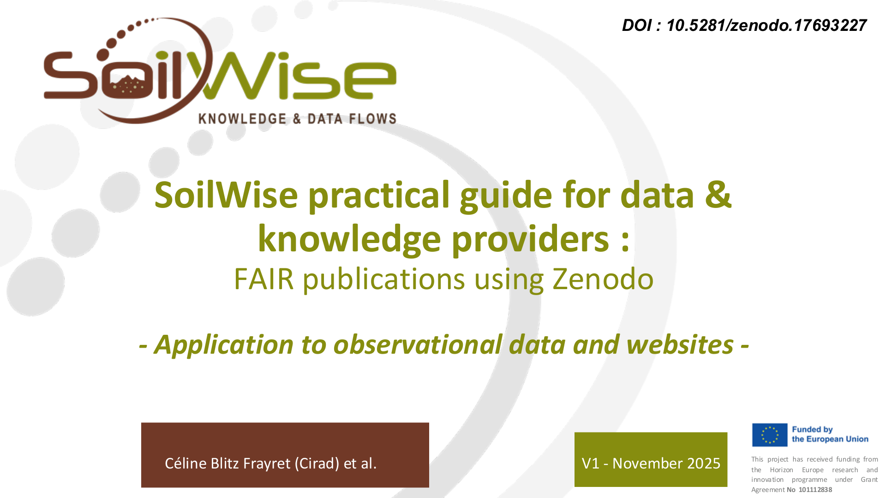

Raw text - page 1

<pre>
This project has received funding from
the
Horizon
Europe
research
and
innovation
programme
under
Grant
Agreement No 101112838
SoilWise practical guide for data &amp; 
knowledge providers : 
FAIR publications using Zenodo
- Application to observational data and websites -
Céline Blitz Frayret (Cirad) et al.
V1 - November 2025
DOI : 10.5281/zenodo.17693227
</pre>

### Page 2

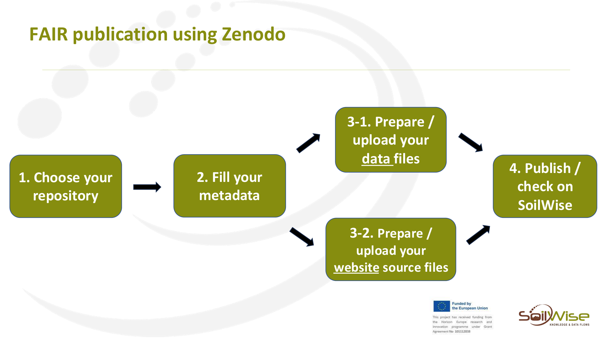

Raw text - page 2

<pre>
FAIR publication using Zenodo
3-1. Prepare / 
upload your
data files
2. Fill your
metadata
1. Choose your
repository
4. Publish / 
check on 
SoilWise
3-2. Prepare / 
upload your
website source files
</pre>

### Page 3

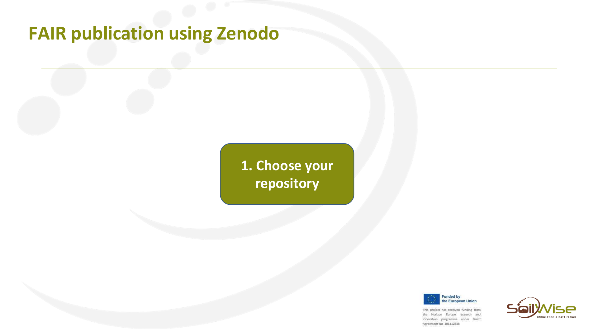

Raw text - page 3

<pre>
FAIR publication using Zenodo
1. Choose your
repository
</pre>

### Page 4

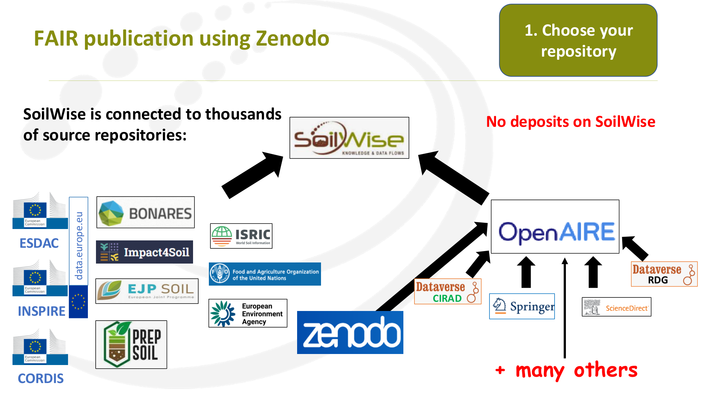

Raw text - page 4

<pre>
1. Choose your
repository
FAIR publication using Zenodo
SoilWise is connected to thousands
of source repositories:
No deposits on SoilWise
CIRAD
RDG
+ many others
ESDAC
INSPIRE
CORDIS
data.europe.eu
</pre>

### Page 5

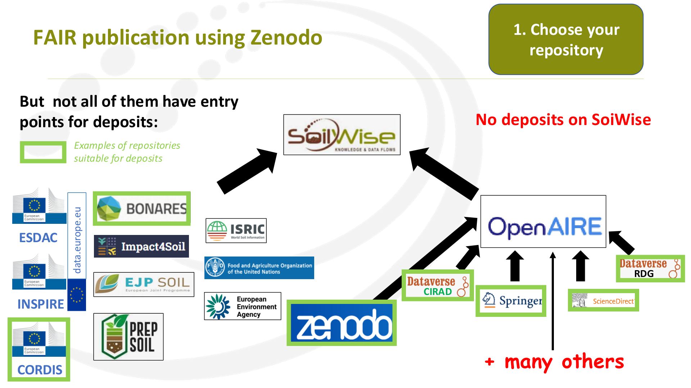

Raw text - page 5

<pre>
1. Choose your
repository
FAIR publication using Zenodo
But  not all of them have entry 
points for deposits:
No deposits on SoiWise
CIRAD
RDG
+ many others
ESDAC
INSPIRE
CORDIS
data.europe.eu
Examples of repositories 
suitable for deposits
</pre>

### Page 6

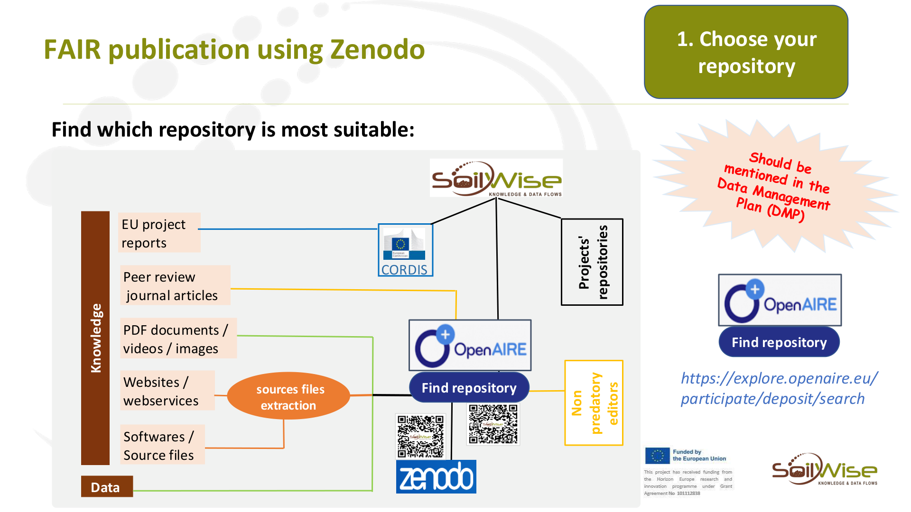

Raw text - page 6

<pre>
1. Choose your
repository
FAIR publication using Zenodo
Find which repository is most suitable:
CORDIS
Projects&#x27;
repositories
Knowledge
Websites / 
webservices
Peer review
journal articles
EU project 
reports
sources files 
extraction
Non 
predatory
editors
Data
PDF documents / 
videos / images
Softwares / 
Source files
Find repository
https://explore.openaire.eu/
participate/deposit/search
Find repository
</pre>

### Page 7

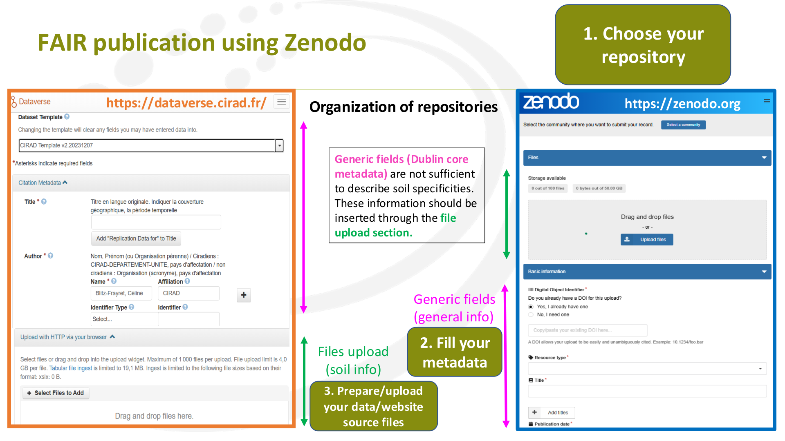

Raw text - page 7

<pre>
FAIR publication using Zenodo
Organization of repositories
https://dataverse.cirad.fr/
Generic fields
(general info)
https://zenodo.org
Files upload
(soil info)
2. Fill your
metadata
Generic fields (Dublin core 
metadata) are not sufficient 
to describe soil specificities. 
These information should be 
inserted through the file 
upload section.
1. Choose your
repository
3. Prepare/upload
your data/website
source files
</pre>

### Page 8

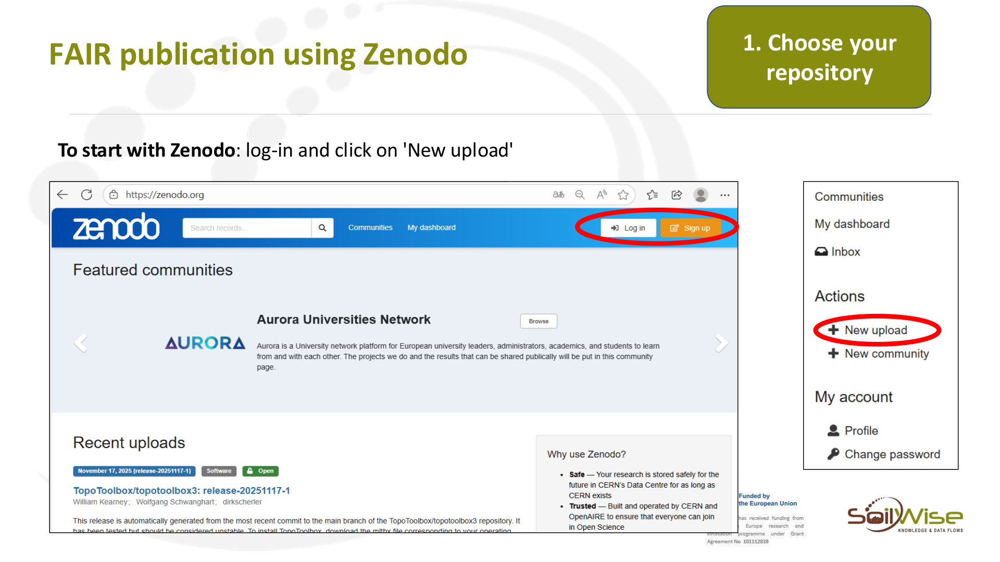

Raw text - page 8

<pre>
FAIR publication using Zenodo
1. Choose your
repository
To start with Zenodo: log-in and click on &#x27;New upload&#x27;
</pre>

### Page 9

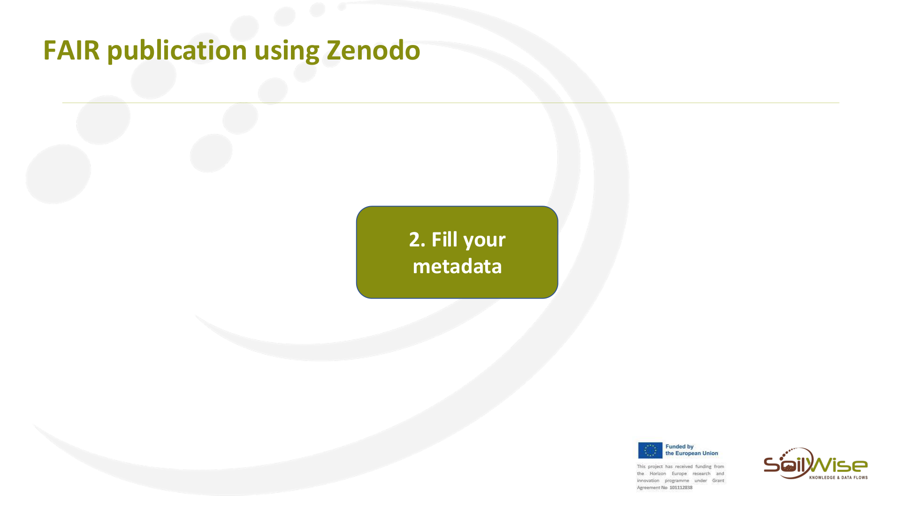

Raw text - page 9

<pre>
FAIR publication using Zenodo
2. Fill your
metadata
</pre>

### Page 10

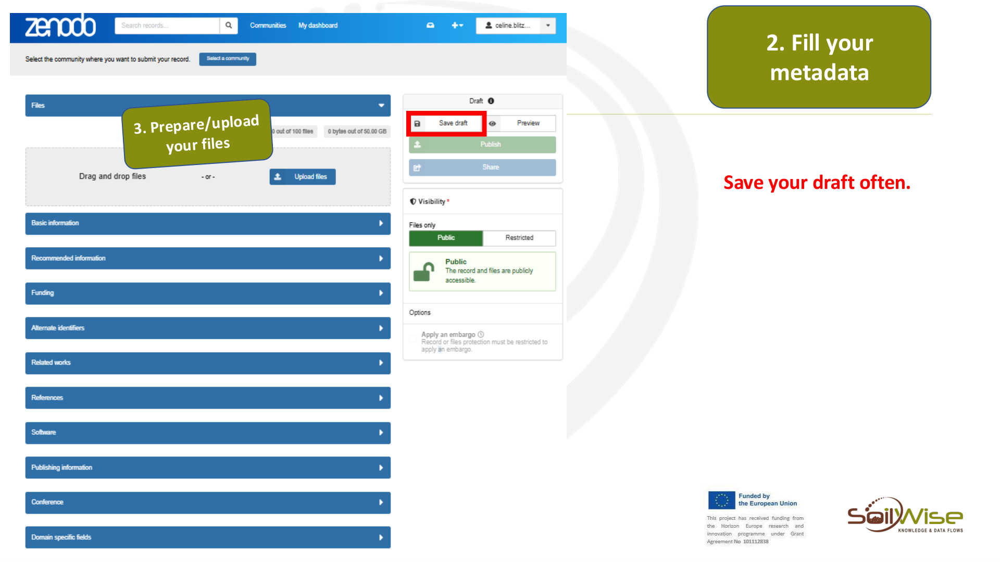

Raw text - page 10

<pre>
FAIR data publication using Zenodo
2. Fill your
metadata
Save your draft often.
</pre>

### Page 11

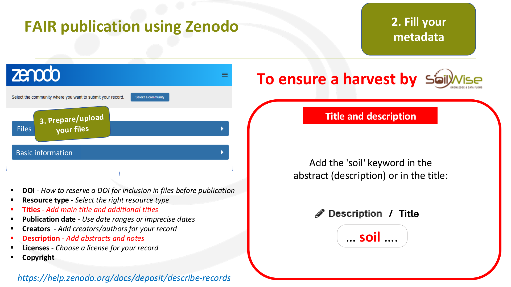

Raw text - page 11

<pre>
FAIR publication using Zenodo
2. Fill your
metadata
Files
Basic information
Title and description
▪
DOI - How to reserve a DOI for inclusion in files before publication
▪
Resource type - Select the right resource type
▪
Titles - Add main title and additional titles
▪
Publication date - Use date ranges or imprecise dates
▪
Creators - Add creators/authors for your record
▪
Description - Add abstracts and notes
▪
Licenses - Choose a license for your record
▪
Copyright
https://help.zenodo.org/docs/deposit/describe-records
… soil ….
/ Title
Add the &#x27;soil&#x27; keyword in the 
abstract (description) or in the title:
To ensure a harvest by
</pre>

### Page 12

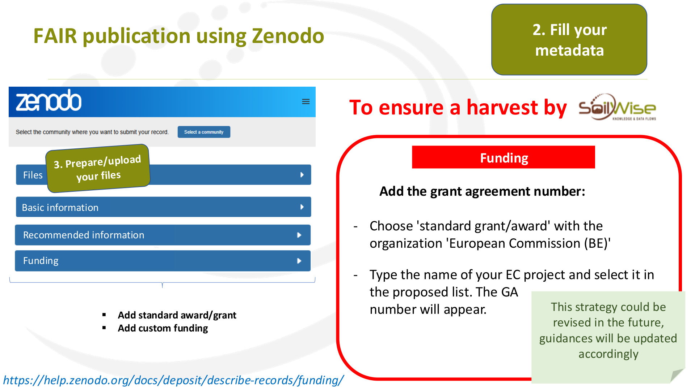

Raw text - page 12

<pre>
Funding
FAIR publication using Zenodo
2. Fill your
metadata
Files
Basic information
Recommended information
▪
Add standard award/grant
▪
Add custom funding
Funding
https://help.zenodo.org/docs/deposit/describe-records/funding/
    Add the grant agreement number:
-
Choose &#x27;standard grant/award&#x27; with the 
organization &#x27;European Commission (BE)&#x27;
-
Type the name of your EC project and select it in 
the proposed list. The GA
  number will appear.
To ensure a harvest by
This strategy could be
revised in the future, 
guidances will be updated
accordingly
</pre>

### Page 13

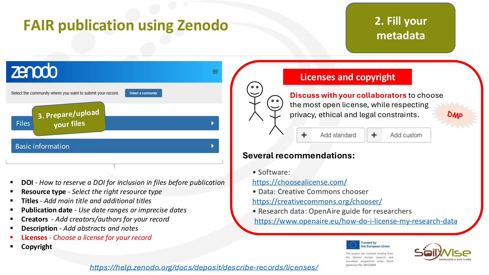

Raw text - page 13

<pre>
FAIR publication using Zenodo
2. Fill your
metadata
Files
Basic information
▪
DOI - How to reserve a DOI for inclusion in files before publication
▪
Resource type - Select the right resource type
▪
Titles - Add main title and additional titles
▪
Publication date - Use date ranges or imprecise dates
▪
Creators - Add creators/authors for your record
▪
Description - Add abstracts and notes
▪
Licenses - Choose a license for your record
▪
Copyright
Licenses and copyright
Discuss with your collaborators to choose 
the most open license, while respecting 
privacy, ethical and legal constraints.
• Software: 
https://choosealicense.com/
• Data: Creative Commons chooser 
https://creativecommons.org/chooser/
• Research data: OpenAire guide for researchers 
https://www.openaire.eu/how-do-i-license-my-research-data
Several recommendations:
https://help.zenodo.org/docs/deposit/describe-records/licenses/
</pre>

### Page 14

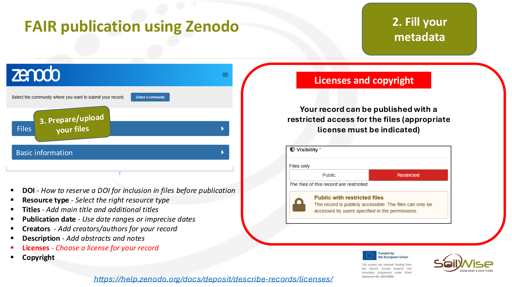

Raw text - page 14

<pre>
FAIR publication using Zenodo
2. Fill your
metadata
Files
Basic information
▪
DOI - How to reserve a DOI for inclusion in files before publication
▪
Resource type - Select the right resource type
▪
Titles - Add main title and additional titles
▪
Publication date - Use date ranges or imprecise dates
▪
Creators - Add creators/authors for your record
▪
Description - Add abstracts and notes
▪
Licenses - Choose a license for your record
▪
Copyright
Licenses and copyright
Your record can be published with a 
restricted access for the files (appropriate 
license must be indicated)
https://help.zenodo.org/docs/deposit/describe-records/licenses/
</pre>

### Page 15

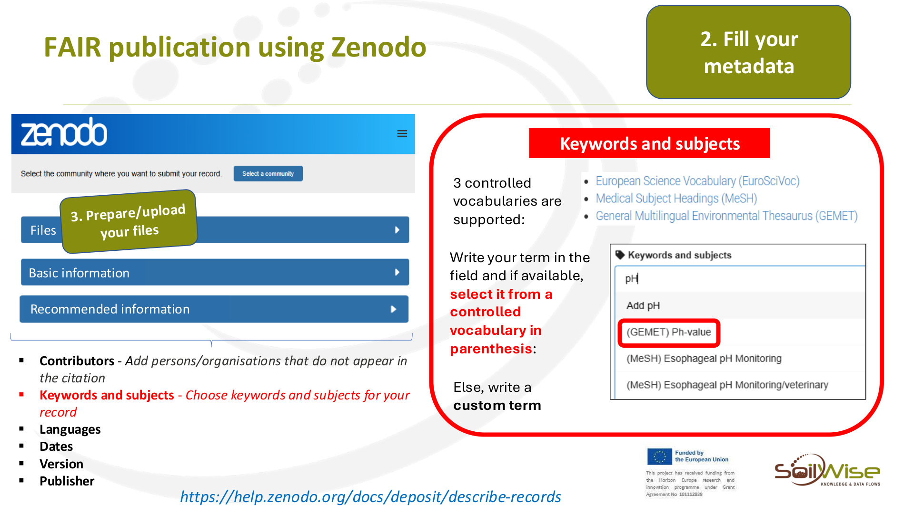

Raw text - page 15

<pre>
FAIR publication using Zenodo
2. Fill your
metadata
Files
Basic information
Recommended information
▪
Contributors - Add persons/organisations that do not appear in 
the citation
▪
Keywords and subjects - Choose keywords and subjects for your 
record
▪
Languages
▪
Dates
▪
Version
▪
Publisher
Keywords and subjects
https://help.zenodo.org/docs/deposit/describe-records
3 controlled 
vocabularies are 
supported:
Write your term in the 
field and if available, 
select it from a 
controlled 
vocabulary in 
parenthesis:
Else, write a 
custom term
</pre>

### Page 16

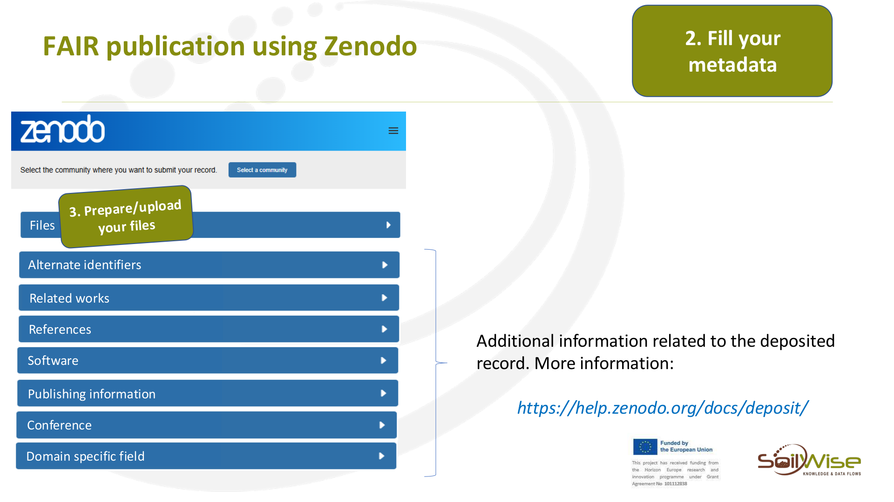

Raw text - page 16

<pre>
FAIR publication using Zenodo
2. Fill your
metadata
Files
Alternate identifiers
Related works
References
Software
Publishing information
Conference
Domain specific field
Additional information related to the deposited 
record. More information:
https://help.zenodo.org/docs/deposit/
</pre>

### Page 17

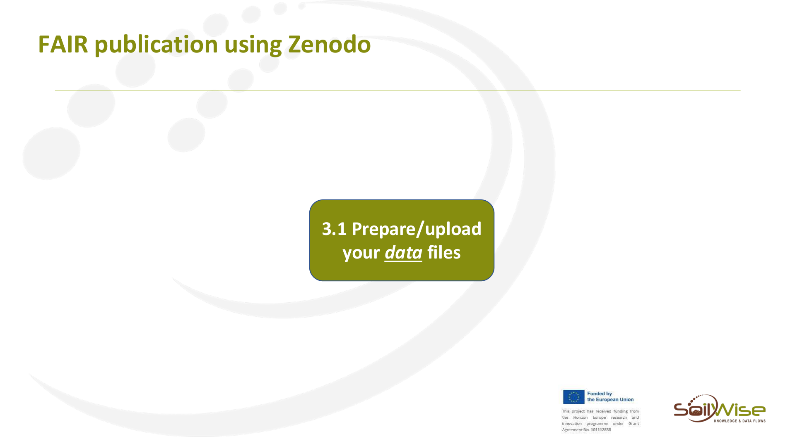

Raw text - page 17

<pre>
FAIR publication using Zenodo
3.1 Prepare/upload
your data files
</pre>

### Page 18

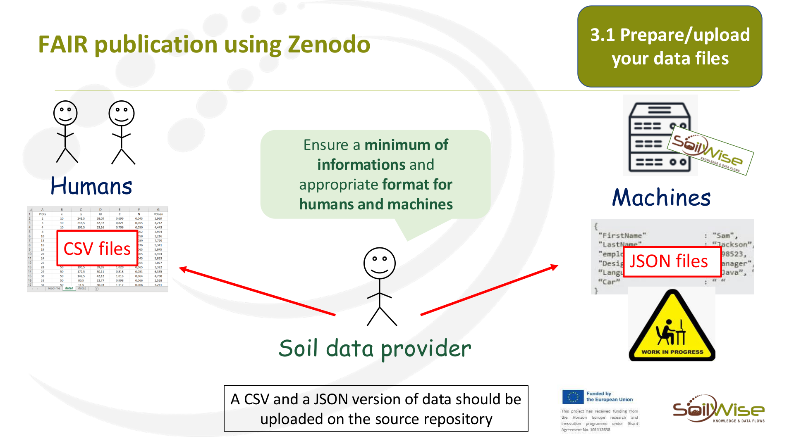

Raw text - page 18

<pre>
FAIR publication using Zenodo
Humans
Machines
CSV files
JSON files
Soil data provider
Ensure a minimum of 
informations and 
appropriate format for 
humans and machines
A CSV and a JSON version of data should be 
uploaded on the source repository
3.1 Prepare/upload
your data files
</pre>

### Page 19

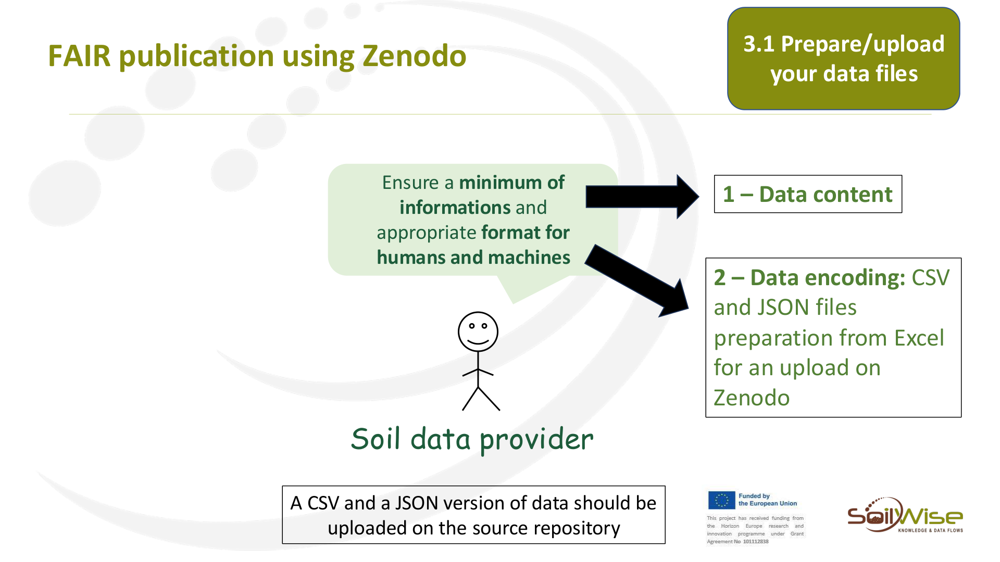

Raw text - page 19

<pre>
FAIR publication using Zenodo
Soil data provider
Ensure a minimum of 
informations and 
appropriate format for 
humans and machines
A CSV and a JSON version of data should be 
uploaded on the source repository
3.1 Prepare/upload
your data files
1 – Data content
2 – Data encoding: CSV 
and JSON files 
preparation from Excel 
for an upload on 
Zenodo
</pre>

### Page 20

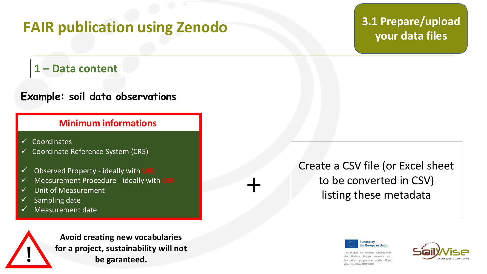

Raw text - page 20

<pre>
FAIR publication using Zenodo
1 – Data content
Example: soil data observations
Create a CSV file (or Excel sheet
to be converted in CSV) 
listing these metadata
+
!
Avoid creating new vocabularies
for a project, sustainability will not 
be garanteed.
3.1 Prepare/upload
your data files
✓Coordinates
✓Coordinate Reference System (CRS)
✓ Observed Property - ideally with URI
✓ Measurement Procedure - ideally with URI
✓ Unit of Measurement 
✓ Sampling date
✓ Measurement date
Minimum informations
</pre>

### Page 21

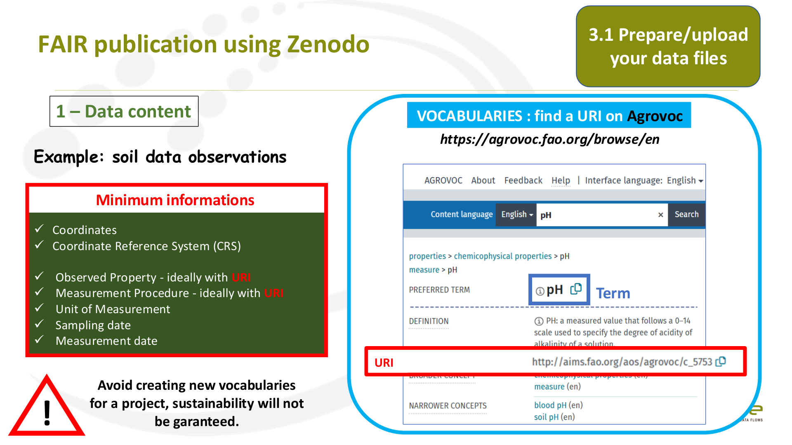

Raw text - page 21

<pre>
FAIR publication using Zenodo
1 – Data content
Example: soil data observations
✓Coordinates
✓Coordinate Reference System (CRS)
✓ Observed Property - ideally with URI
✓ Measurement Procedure - ideally with URI
✓ Unit of Measurement 
✓ Sampling date
✓ Measurement date
Minimum informations
!
Avoid creating new vocabularies
for a project, sustainability will not 
be garanteed.
3.1 Prepare/upload
your data files
VOCABULARIES : find a URI on Agrovoc
https://agrovoc.fao.org/browse/en
URI
Term
</pre>

### Page 22

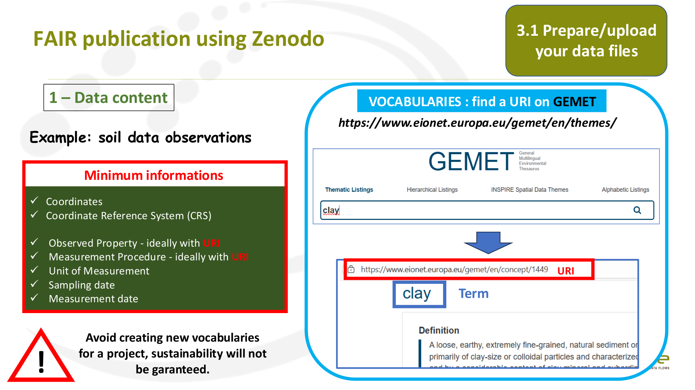

Raw text - page 22

<pre>
FAIR publication using Zenodo
1 – Data content
Example: soil data observations
!
Avoid creating new vocabularies
for a project, sustainability will not 
be garanteed.
3.1 Prepare/upload
your data files
VOCABULARIES : find a URI on GEMET
https://www.eionet.europa.eu/gemet/en/themes/
URI
Term
✓Coordinates
✓Coordinate Reference System (CRS)
✓ Observed Property - ideally with URI
✓ Measurement Procedure - ideally with URI
✓ Unit of Measurement 
✓ Sampling date
✓ Measurement date
Minimum informations
</pre>

### Page 23

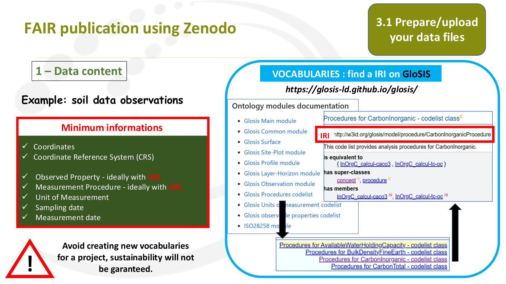

Raw text - page 23

<pre>
FAIR publication using Zenodo
1 – Data content
Example: soil data observations
✓Coordinates
✓Coordinate Reference System (CRS)
✓ Observed Property - ideally with URI
✓ Measurement Procedure - ideally with URI
✓ Unit of Measurement 
✓ Sampling date
✓ Measurement date
Minimum informations
!
Avoid creating new vocabularies
for a project, sustainability will not 
be garanteed.
3.1 Prepare/upload
your data files
VOCABULARIES : find a IRI on GloSIS
https://glosis-ld.github.io/glosis/
IRI
</pre>

### Page 24

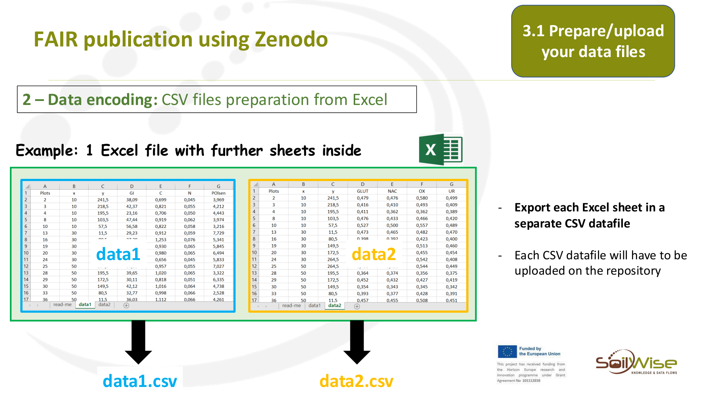

Raw text - page 24

<pre>
FAIR publication using Zenodo
-
Export each Excel sheet in a 
separate CSV datafile
-
Each CSV datafile will have to be
uploaded on the repository 
data1
data2
data1.csv
data2.csv
Example: 1 Excel file with further sheets inside 
3.1 Prepare/upload
your data files
2 – Data encoding: CSV files preparation from Excel
</pre>

### Page 25

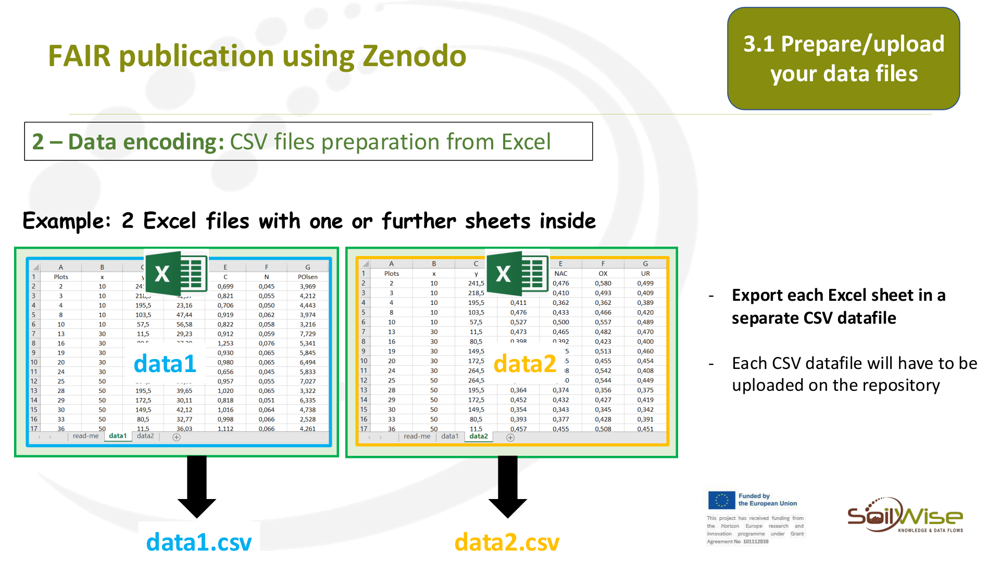

Raw text - page 25

<pre>
FAIR publication using Zenodo
-
Export each Excel sheet in a 
separate CSV datafile
-
Each CSV datafile will have to be
uploaded on the repository 
data1
data2
data1.csv
data2.csv
Example: 2 Excel files with one or further sheets inside
2 – Data encoding: CSV files preparation from Excel
3.1 Prepare/upload
your data files
</pre>

### Page 26

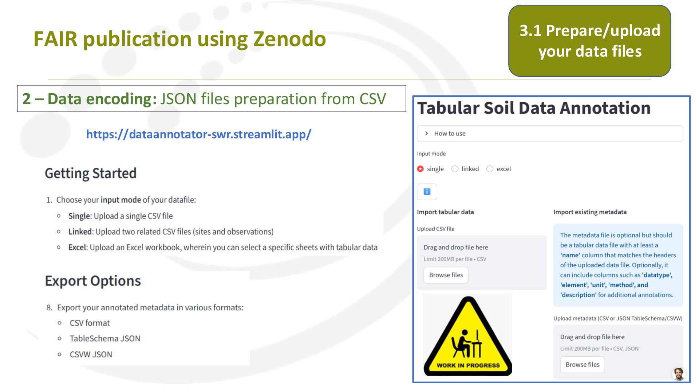

Raw text - page 26

<pre>
FAIR publication using Zenodo
2 – Data encoding: JSON files preparation from CSV
3.1 Prepare/upload
your data files
https://dataannotator-swr.streamlit.app/
</pre>

### Page 27

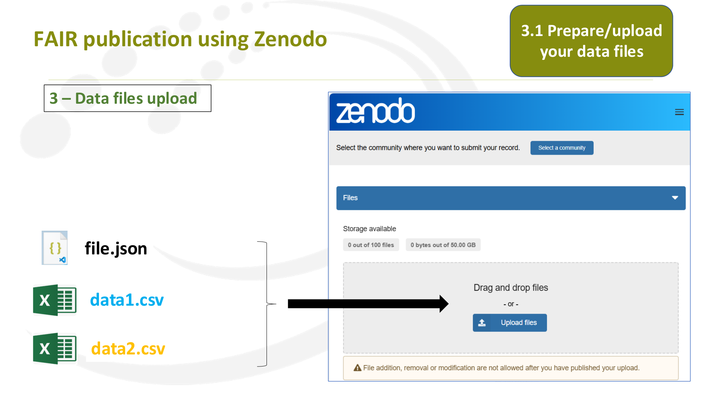

Raw text - page 27

<pre>
FAIR publication using Zenodo
3 – Data files upload
data1.csv
data2.csv
file.json
3.1 Prepare/upload
your data files
</pre>

### Page 28

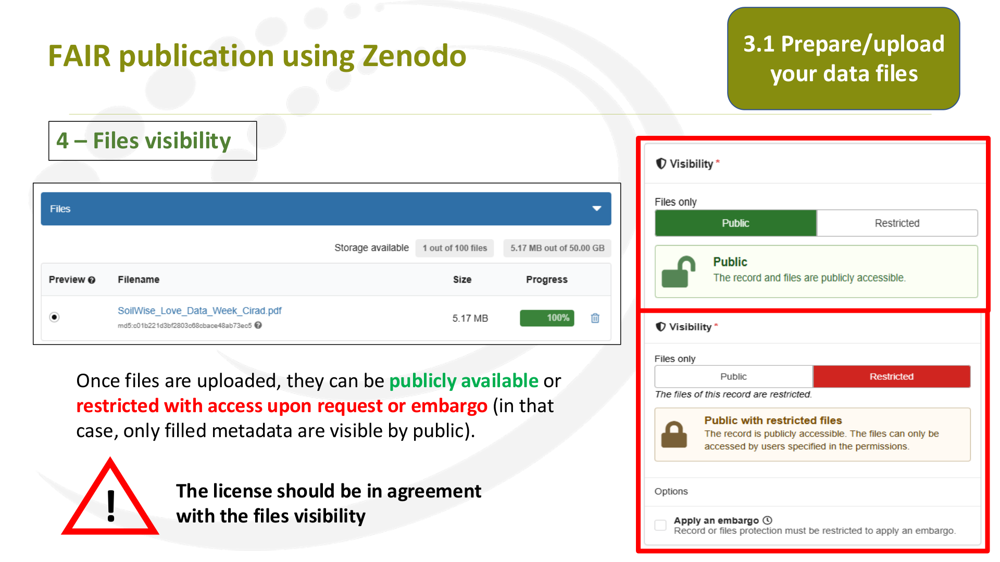

Raw text - page 28

<pre>
FAIR publication using Zenodo
4 – Files visibility
Once files are uploaded, they can be publicly available or 
restricted with access upon request or embargo (in that 
case, only filled metadata are visible by public).
!
The license should be in agreement 
with the files visibility
3.1 Prepare/upload
your data files
</pre>

### Page 29

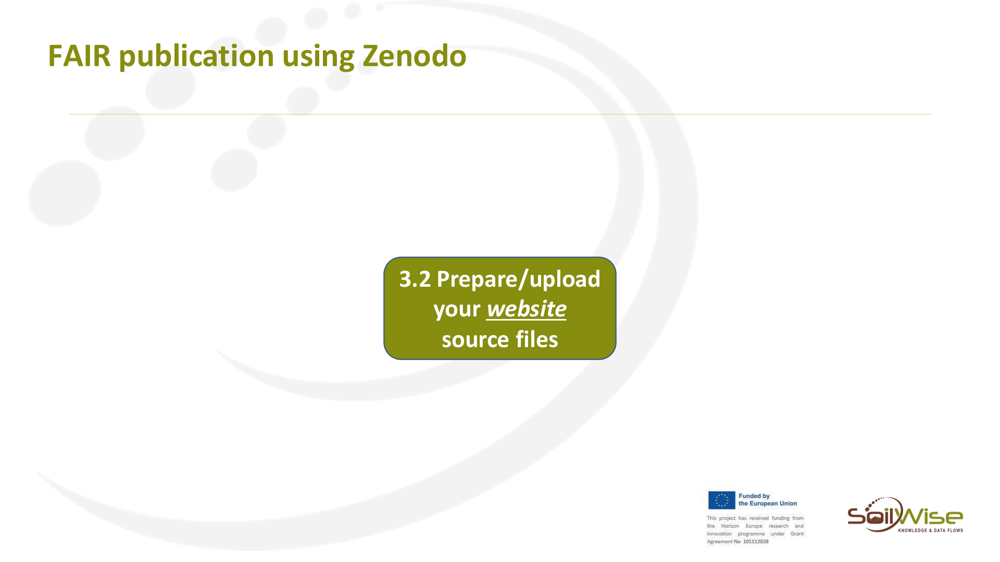

Raw text - page 29

<pre>
FAIR publication using Zenodo
3.2 Prepare/upload
your website
source files
</pre>

### Page 30

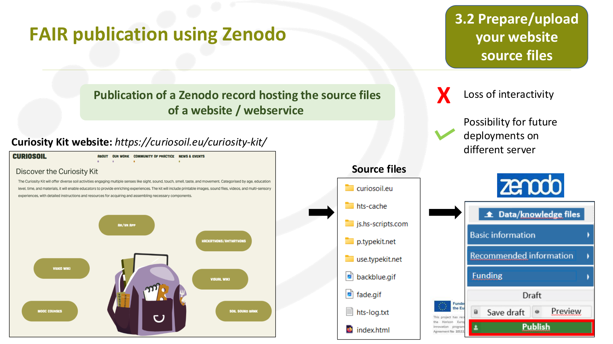

Raw text - page 30

<pre>
FAIR publication using Zenodo
3.2 Prepare/upload
your website
source files
Curiosity Kit website: https://curiosoil.eu/curiosity-kit/
Publication of a Zenodo record hosting the source files 
of a website / webservice
Source files
Loss of interactivity
Possibility for future 
deployments on 
different server
X
</pre>

### Page 31

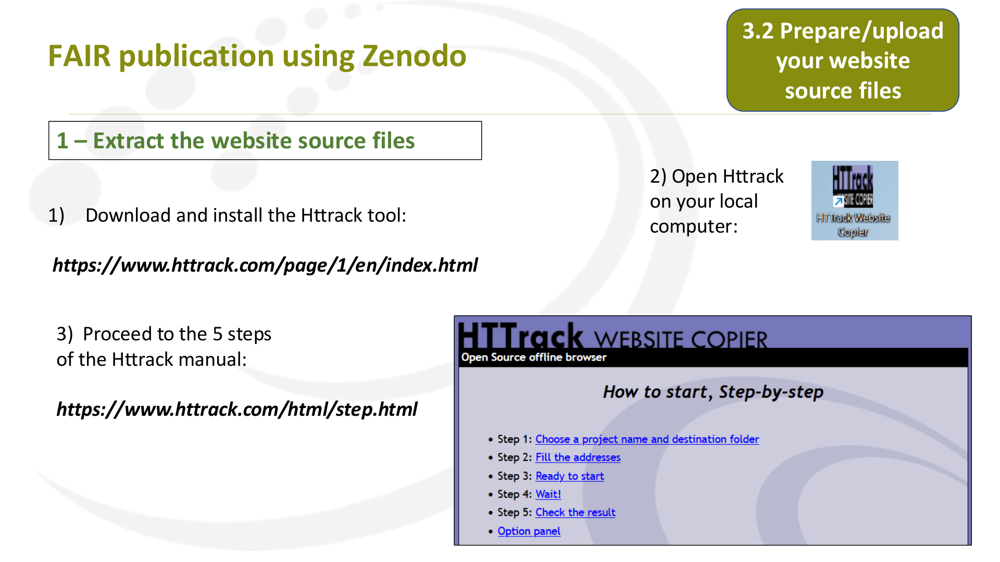

Raw text - page 31

<pre>
FAIR publication using Zenodo
1 – Extract the website source files
3.2 Prepare/upload
your website
source files
1)
Download and install the Httrack tool:
https://www.httrack.com/page/1/en/index.html
2) Open Httrack 
on your local 
computer:
3) Proceed to the 5 steps 
of the Httrack manual:
https://www.httrack.com/html/step.html
</pre>

### Page 32

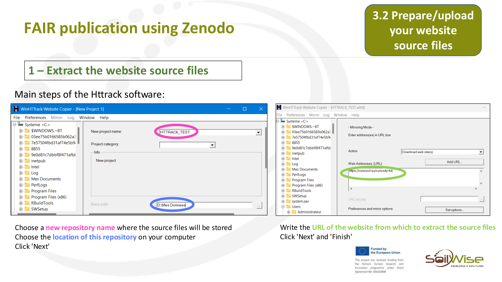

Raw text - page 32

<pre>
FAIR publication using Zenodo
1 – Extract the website source files
3.2 Prepare/upload
your website
source files
Main steps of the Httrack software:
Choose a new repository name where the source files will be stored
Choose the location of this repository on your computer
Click &#x27;Next&#x27;
Write the URL of the website from which to extract the source files
Click &#x27;Next&#x27; and &#x27;Finish&#x27;
</pre>

### Page 33

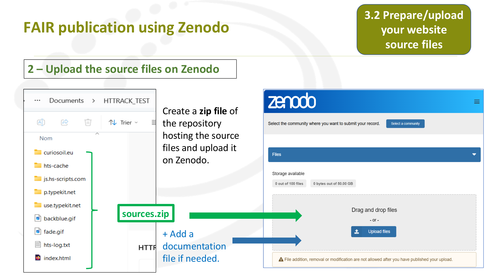

Raw text - page 33

<pre>
FAIR publication using Zenodo
2 – Upload the source files on Zenodo
3.2 Prepare/upload
your website
source files
Create a zip file of 
the repository 
hosting the source 
files and upload it 
on Zenodo.
+ Add a 
documentation 
file if needed.
sources.zip
</pre>

### Page 34

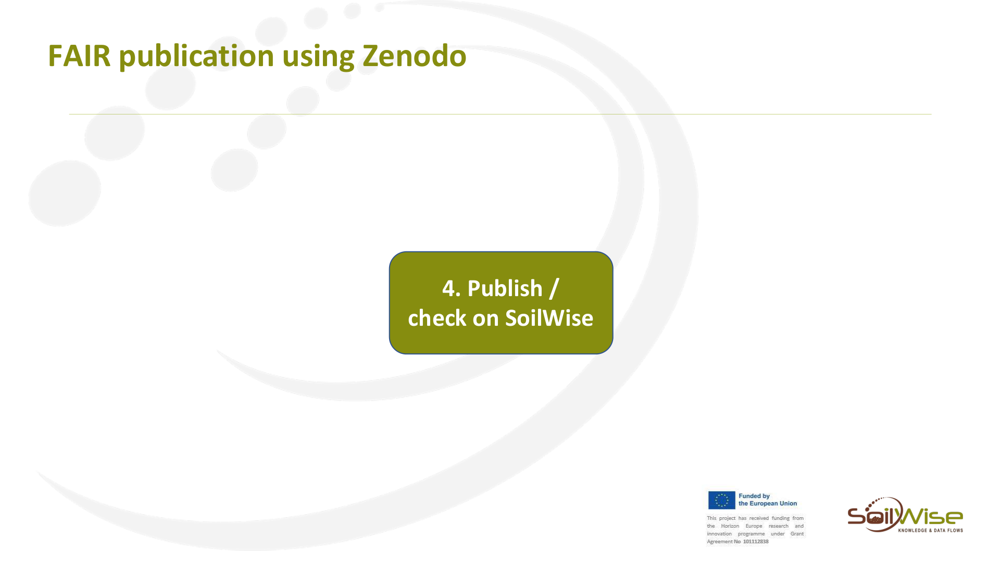

Raw text - page 34

<pre>
FAIR publication using Zenodo
4. Publish / 
check on SoilWise
</pre>

### Page 35

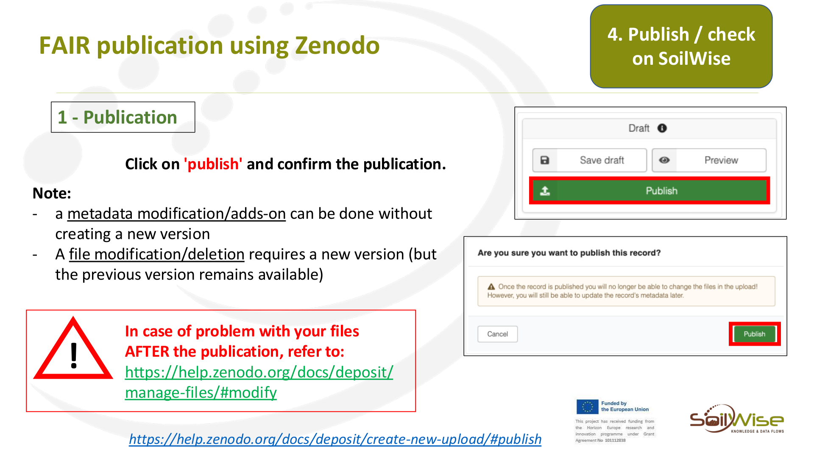

Raw text - page 35

<pre>
FAIR publication using Zenodo
4. Publish / check 
on SoilWise
Click on &#x27;publish&#x27; and confirm the publication. 
!
In case of problem with your files 
AFTER the publication, refer to:
https://help.zenodo.org/docs/deposit/
manage-files/#modify
https://help.zenodo.org/docs/deposit/create-new-upload/#publish
Note: 
-
a metadata modification/adds-on can be done without 
creating a new version
-
A file modification/deletion requires a new version (but 
the previous version remains available)
1 - Publication
</pre>

### Page 36

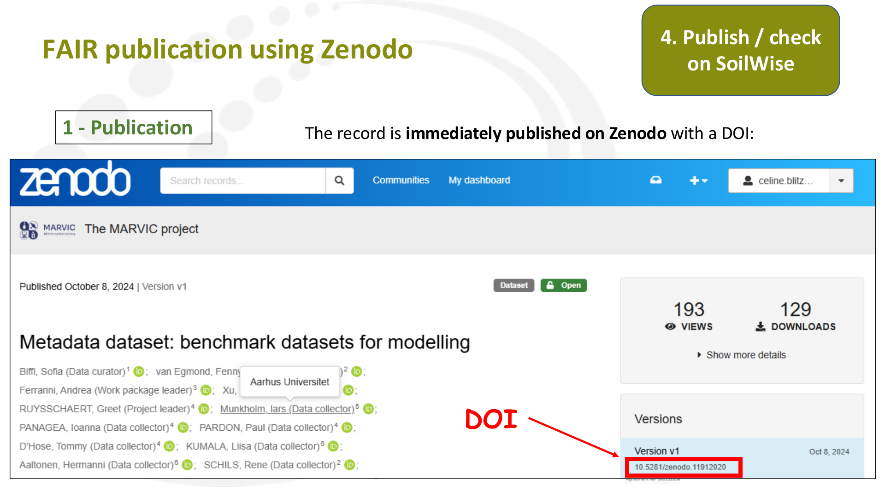

Raw text - page 36

<pre>
FAIR publication using Zenodo
4. Publish / check 
on SoilWise
DOI
1 - Publication
The record is immediately published on Zenodo with a DOI:
</pre>

### Page 37

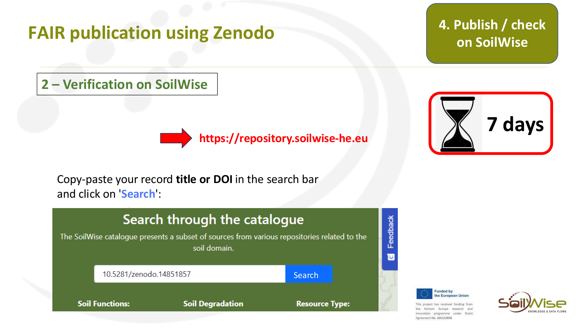

Raw text - page 37

<pre>
FAIR publication using Zenodo
4. Publish / check 
on SoilWise
2 – Verification on SoilWise
Copy-paste your record title or DOI in the search bar 
and click on &#x27;Search&#x27;:
https://repository.soilwise-he.eu
7 days
Search
</pre>

### Page 38

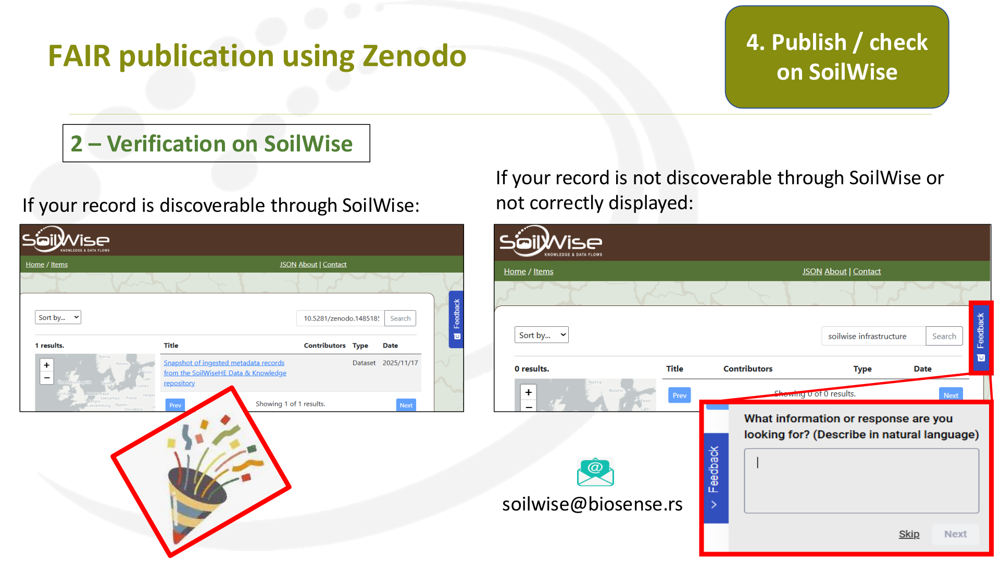

Raw text - page 38

<pre>
FAIR publication using Zenodo
4. Publish / check 
on SoilWise
2 – Verification on SoilWise
If your record is discoverable through SoilWise:
If your record is not discoverable through SoilWise or 
not correctly displayed:
soilwise@biosense.rs
</pre>

